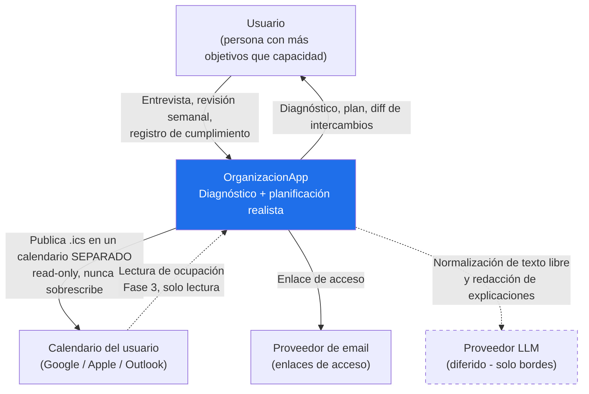
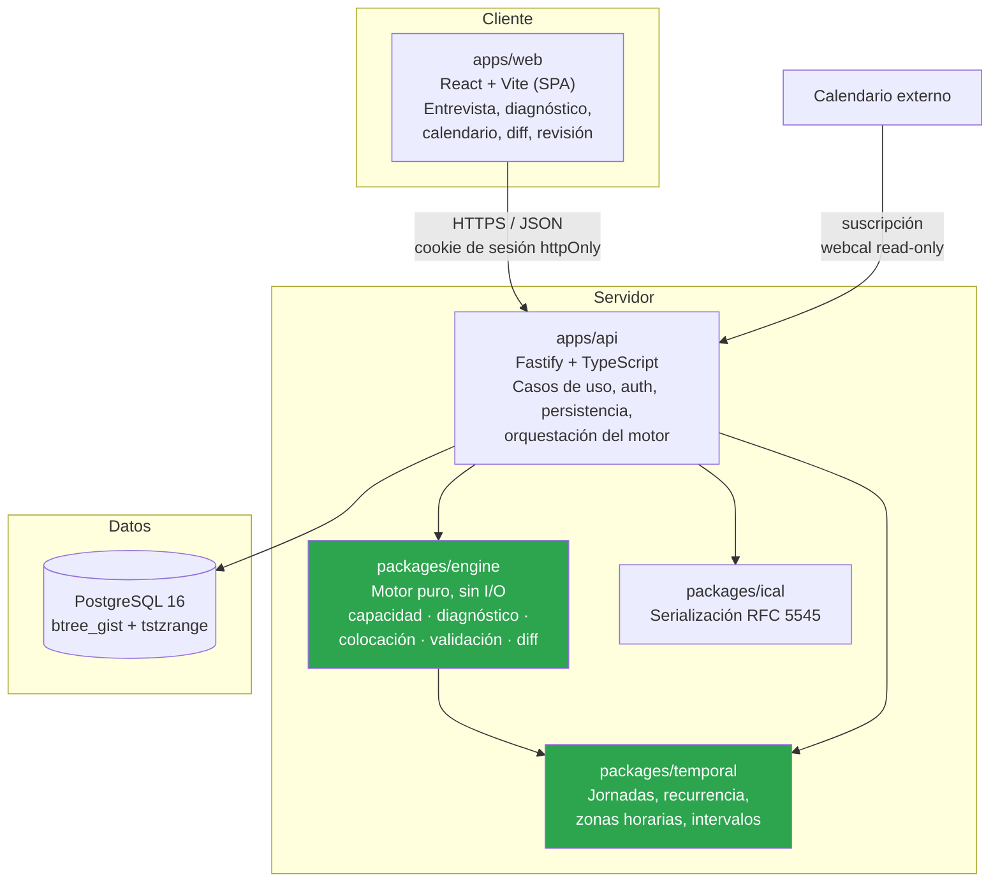
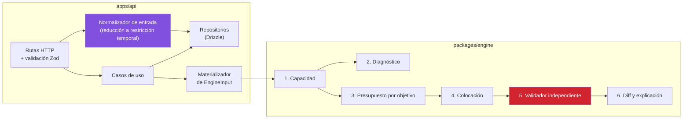
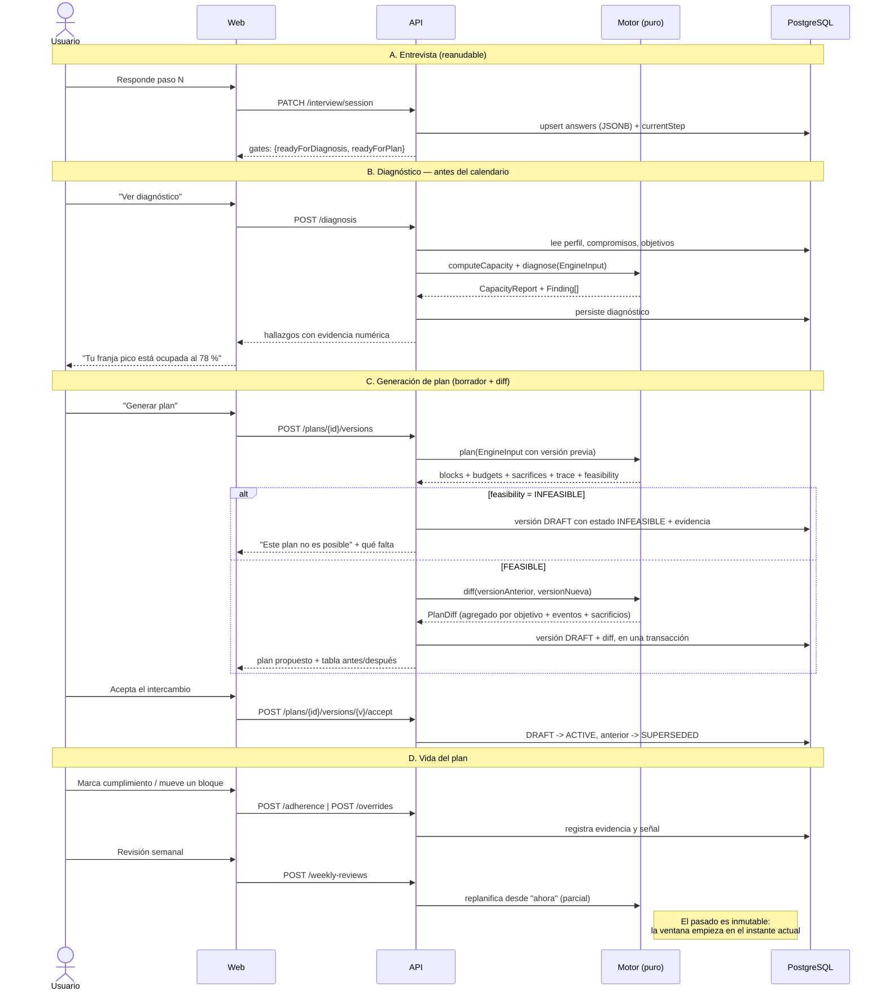

# 01 — Arquitectura

Fecha: 2026-07-24
Decisiones de soporte: [ADR-001](./adr/ADR-001-stack-y-monorepo.md), [ADR-002](./adr/ADR-002-persistencia-postgresql.md), [ADR-003](./adr/ADR-003-modelo-temporal-y-zonas-horarias.md), [ADR-004](./adr/ADR-004-motor-determinista-vs-llm.md), [ADR-013](./adr/ADR-013-motor-como-funcion-pura.md)

---

## 1. La decisión estructural, primero

Todo lo demás en este documento es reversible. Esto no:

> **El motor de planificación es una función pura, sin acceso a base de datos, red ni
> reloj del sistema.** Vive en un paquete propio. Recibe un `EngineInput` completo y
> devuelve un `EngineOutput` completo.

Consecuencias que justifican el coste (hay que materializar la entrada entera antes de
llamarlo):

- Es **testeable de forma determinista**: cada variante de la §5 del brief se convierte en
  un fixture JSON ejecutable. La sección 5 del brief deja de ser prosa y pasa a ser una
  suite de tests.
- Es **reproducible**: guardando el `EngineInput` (o su hash) se puede reproducir
  exactamente cualquier plan generado seis meses atrás, para depurar una queja real.
- Permite **generar sin persistir**: previsualizar un plan con un cambio hipotético sin
  crear una versión. Esto es lo que hace posible mostrar el intercambio *antes* de aceptarlo.
- Desacopla el ritmo de evolución del algoritmo del de la aplicación.

Ver [ADR-013](./adr/ADR-013-motor-como-funcion-pura.md).

## 2. Vista de contexto



Dos cosas que este diagrama afirma deliberadamente:

- **La flecha hacia el calendario es de un solo sentido y hacia un calendario separado.**
  Es la implementación de "no obligar a migrar" y de "reversibilidad": borrar el plan es
  borrar un calendario, sin daño colateral. Ver [ADR-008](./adr/ADR-008-sincronizacion-calendarios.md).
- **El LLM está fuera del lazo de decisión.** Ver [ADR-004](./adr/ADR-004-motor-determinista-vs-llm.md).

## 3. Vista de contenedores



| Contenedor | Responsabilidad | Lo que NO hace |
|---|---|---|
| `apps/web` | Captura, visualización, confirmación de intercambios | Ninguna regla de planificación. Ni siquiera "esto no cabe". |
| `apps/api` | Autenticación, autorización, transacciones, materialización de la entrada del motor, persistencia de versiones | No decide colocación ni prioridades |
| `packages/engine` | **Todas** las reglas de la §4 del brief | No conoce Postgres, HTTP, `Date.now()` ni el usuario |
| `packages/temporal` | Aritmética temporal correcta (jornadas, DST, recurrencia, medianoche) | No conoce el dominio de planificación |
| `packages/ical` | Emisión y parseo de `.ics` | No decide qué se exporta. **No lee el reloj**: los instantes del `.ics`, `DTSTAMP` incluido, entran como dato ([ADR-017](./adr/ADR-017-determinismo-del-ics.md)) |

**La frontera que no se cruza:** ningún tipo de Drizzle, ninguna fila de base de datos y
ningún `Date` construido desde el reloj entra en `packages/engine`. El API traduce.

## 4. Vista de componentes del servidor



Dos componentes merecen justificación explícita:

**El validador (rojo) no comparte código con el colocador.** Está escrito de forma
independiente y vuelve a comprobar los invariantes desde cero sobre la salida. Si compartiera
las utilidades del colocador, un bug en esa utilidad haría que la validación fuera una
tautología. Es el patrón *generate-and-verify*: se paga duplicación deliberada a cambio de
que "cero solapes" sea una garantía real. Detalle en [03 §7](./03-motor-de-planificacion.md).

**El normalizador (morado) es una exigencia de privacidad, no una comodidad.** Es el
componente que convierte texto libre en restricción temporal y **descarta** cualquier
etiqueta clínica antes de que toque el almacenamiento. Ver
[ADR-011](./adr/ADR-011-privacidad-por-diseno.md).

## 5. Flujo de datos de extremo a extremo



**El punto crítico del flujo es C.** La generación produce un **borrador** que trae su diff
adjunto, y la activación es un segundo paso explícito. Esto convierte "ningún intercambio es
silencioso" en una propiedad del protocolo: no existe una secuencia de llamadas que active
un plan sin que el cliente haya recibido antes lo que se sacrificó.

## 6. Estructura de repositorio

```
OrganizacionApp/
├─ apps/
│  ├─ api/                  # Fastify. Casos de uso, auth, repos, rutas
│  └─ web/                  # React + Vite
├─ packages/
│  ├─ domain/               # Tipos y value objects del dominio. Sin I/O
│  ├─ temporal/             # Jornadas, recurrencia, zonas horarias, intervalos
│  ├─ engine/               # EL MOTOR. Función pura
│  ├─ ical/                 # RFC 5545 in/out
│  └─ contracts/            # Esquemas Zod compartidos API <-> Web
├─ docs/
│  └─ arquitectura/
│     ├─ 00..07-*.md
│     └─ adr/
├─ CLAUDE.md
└─ pnpm-workspace.yaml
```

Regla de dependencias, verificada en CI con `dependency-cruiser`:

```
web ──> contracts
api ──> contracts, domain, temporal, engine, ical
engine ──> domain, temporal
temporal ──> (nada del proyecto)
domain ──> (nada del proyecto)
```

Prohibido: `engine -> api`, `engine -> contracts`, `temporal -> domain`, cualquier import de
Drizzle o Fastify dentro de `engine` o `temporal`. Un test de arquitectura falla el build si
esto se rompe — es la única forma de que la frontera sobreviva a la presión de las fechas.

## 7. Dónde vive el motor y por qué ahí

**Vive en un paquete de la capa de servidor, invocado en proceso por el API.** Alternativas
evaluadas:

| Opción | Por qué no |
|---|---|
| En el cliente (WASM/JS) | La validación de un plan y el registro de sacrificios son la garantía del producto; ejecutarlos en un entorno que el usuario controla los hace no auditables. Además necesita la entrada completa en el cliente, con el coste de privacidad de bajar toda la agenda. |
| Como microservicio propio | No hay razón operativa: latencia esperada < 2 s, sin escalado independiente, un solo consumidor. Añadiría serialización, despliegue y observabilidad distribuida a cambio de nada. Se puede extraer después precisamente porque es una función pura. |
| En la base de datos (SQL/PLpgSQL) | Ilegible, intesteable y acoplado al motor de BD. |
| Dentro de `apps/api` sin paquete propio | Es la opción tentadora y es la que hay que rechazar. Convivir con Fastify y Drizzle hace inevitable que alguien "solo consulte una cosita" desde el motor, y ahí muere el determinismo. |

**Ejecución síncrona en el MVP**, con timeout duro de 5 s y un contador de tiempo de
ejecución instrumentado. No se introduce cola de trabajos: sería complejidad sin problema.
Disparador para reconsiderar: p95 > 2 s o ventanas de planificación > 4 semanas.

**Ventana de planificación: rodante de 14 días** (Q3, resuelta el 2026-07-28), con revisión
semanal. Dos semanas dan margen para que un deadline a diez días sea planificable en lugar de
declararse imposible el lunes, y la segunda semana se replanifica de todas formas.

## 8. Aspectos transversales

### 8.1 Autenticación y autorización

- Acceso sin contraseña por enlace de un solo uso enviado por email; sesión en cookie
  `httpOnly`, `Secure`, `SameSite=Lax`, con sesiones persistidas y revocables.
  Ver [ADR-010](./adr/ADR-010-autenticacion.md).
- **Autorización**: todos los datos cuelgan de `user_id`. Cada repositorio recibe el
  `user_id` del contexto de sesión y lo aplica en el `WHERE`; no existe una consulta de
  entidad de usuario sin ese filtro. Un test de integración por cada endpoint verifica que
  el usuario A no puede leer nada de B.
- Los feeds `.ics` son la excepción: se autentican por token opaco de alta entropía en la
  URL (los clientes de calendario no manejan cookies). Por eso son **revocables y rotables**,
  y exponen el mínimo de información.

### 8.2 Manejo de errores

Tres clases, tratadas distinto:

1. **Errores de entrada** (400/422): validación Zod en el borde. Respuesta con `code`,
   `message` y `details` por campo.
2. **Conflictos de dominio** (409): p. ej. aceptar una versión ya superada. Son esperables.
3. **Plan imposible: NO es un error.** Es una respuesta `200` con
   `feasibility: "INFEASIBLE"` y la evidencia de qué no cabe. Modelarlo como error 4xx/5xx
   sería traicionar la regla nº6 del brief y llevaría a la UI a mostrarlo como fallo.

Los fallos del validador del motor (§7 de [03](./03-motor-de-planificacion.md)) son 500 con
alerta: significan que el colocador produjo algo inválido, un bug de gravedad máxima. Nunca
se entrega un plan que no valide.

### 8.3 Observabilidad

Logging estructurado JSON (pino), con `requestId` y `userId`, y **redacción por defecto**:
títulos de compromisos, tareas y objetivos, y cualquier campo de texto libre **nunca** se
escriben en logs. Se registran identificadores y magnitudes, no contenidos — es la misma
lógica de la §5 de [00](./00-vision-y-alcance.md).

Métricas mínimas del MVP: duración de la generación de plan, tasa de `INFEASIBLE`, tasa de
fallo del validador (debe ser 0), número de versiones por plan, tasa de finalización de la
revisión semanal.

### 8.4 Estrategia de testing

Resumen; el detalle está en [05 §6](./05-plan-de-implementacion.md).

| Capa | Tipo | Herramienta |
|---|---|---|
| `temporal` | Unitario + property-based, con casos DST y cruce de medianoche | Vitest + fast-check |
| `engine` | **Golden tests: un fixture por variante de la §5** + property-based sobre los invariantes de la §4 | Vitest + fast-check |
| `api` | Integración contra **PostgreSQL real** (Testcontainers), sin mocks de BD | Vitest + Testcontainers |
| `web` | Componentes clave + E2E del flujo entrevista → diagnóstico → plan → export | Testing Library + Playwright |

Los mocks de base de datos están prohibidos en la capa de integración: los invariantes más
importantes (constraint de exclusión que impide solapes, cascadas de borrado) viven en el
esquema y un mock los haría invisibles.

### 8.5 Seguridad

- Todo el estado sensible cuelga de `user_id` con borrado en cascada verificado por test.
- Sin secretos en el repo; configuración por variables de entorno validadas con Zod al
  arrancar (falla rápido si falta una).
- Cabeceras: HSTS, CSP restrictiva, `X-Content-Type-Options`.
- Rate limiting en el envío de enlaces de acceso y en la generación de planes (es la
  operación cara).
- Cifrado en reposo delegado al proveedor gestionado de Postgres; no se implementa cifrado a
  nivel de campo en el MVP porque no hay categoría de dato que lo justifique una vez excluida
  la información médica.

### 8.6 Internacionalización

- Zonas horarias IANA y aritmética correcta: **no negociable, entra desde el día uno**
  ([ADR-003](./adr/ADR-003-modelo-temporal-y-zonas-horarias.md)).
- Inicio de semana (lunes/domingo) y formato de fecha: **preferencia de presentación**,
  jamás estructura de datos. El modelo no tiene "semana" como entidad.
- Traducción de la interfaz: diferida, pero el copy se escribe desde el principio a través
  de una función de traducción para no pagar un retrofit completo.

## 9. Despliegue

Ver [ADR-012](./adr/ADR-012-estrategia-de-despliegue.md). Resumen: contenedor único del API
en una PaaS (Fly.io o Railway), Postgres gestionado con copias de seguridad automáticas,
web estática en CDN, migraciones ejecutadas como paso previo del despliegue. Sin Kubernetes,
sin colas, sin caché distribuida: no hay problema que las justifique.
