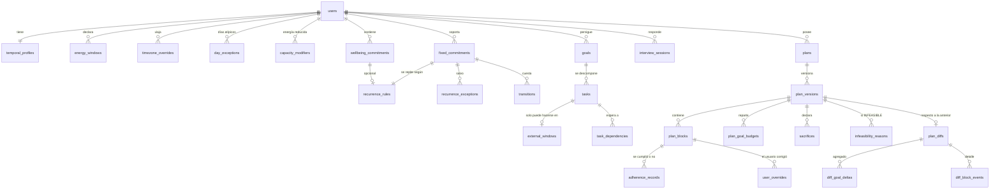

# 02 — Modelo de datos

Fecha: 2026-07-24
Decisiones de soporte: [ADR-002](./adr/ADR-002-persistencia-postgresql.md), [ADR-003](./adr/ADR-003-modelo-temporal-y-zonas-horarias.md), [ADR-005](./adr/ADR-005-recurrencia-y-excepciones.md), [ADR-006](./adr/ADR-006-versionado-de-plan-y-diff.md), [ADR-011](./adr/ADR-011-privacidad-por-diseno.md)

> **Puerta de una sola dirección.** Las secciones 1, 3 y 6 (modelo temporal, recurrencia y
> versionado) son las que no se pueden cambiar sin migración destructiva. El resto es
> reversible con coste bajo.

---

## 1. Los tres axiomas temporales

Todo el modelo descansa sobre esto. Si alguno es falso para este producto, hay que decirlo
antes de escribir una línea de código.

### Axioma 1 — La semana no existe como estructura

No hay tabla `weeks`, ni `weekly_template`, ni columna `day_of_week` como eje del modelo. La
semana es una **ventana de consulta**, nunca una entidad. Una rotación **2-2-3 tiene ciclo de 14
días**, que no cabe en una semana plantilla: alterna entre dos patrones civiles distintos. Un turno
**4×3 tiene ciclo de 7** y sí encaja en una semana; es el único de los casos del brief que lo hace.
Un modelo con "semana plantilla" deja irrepresentable todo lo que no tenga **periodo 1**, y eso es
exactamente lo que el brief prohíbe.

> **Corregido el 2026-07-30.** Este párrafo describía el 4×3 como *"ciclo de 7 días pero desfasado
> respecto a la semana civil"*. **No lo está**: 4 + 3 = 7, así que se repite idéntico cada semana
> con cualquier ancla. El error venía de [ADR-005](./adr/ADR-005-recurrencia-y-excepciones.md), que
> lo arrastra en su contexto y que **no se edita**; queda anotado allí. Lo que hace falta para
> refutar la semana plantilla es **periodo ≥ 2**, siendo el periodo en semanas `L / mcd(L, 7)`.

### Axioma 2 — La unidad de planificación es la jornada, no el día calendario

Una **jornada** (`PlanningDay`) es el ciclo de vigilia: `[wakeAt, nextWakeAt)`, en instantes
UTC absolutos.

Esto resuelve tres problemas de golpe:

- **Cronotipo nocturno.** Para alguien con pico 22:00–01:00, el bloque de las 00:30 pertenece
  naturalmente a la jornada que empezó a las 08:00 del "día anterior". Con día calendario
  habría que tratarlo como excepción; con jornada es el caso normal. El motor no favorece
  estructuralmente al madrugador porque no sabe qué es la madrugada.
- **Aritmética del sueño.** Es una resta dentro de la jornada:
  `sueño = nextWakeAt − sleepAt`. Sin casos especiales de medianoche, sin comparar horas
  locales, sin `if (sleepHour < wakeHour)`. La restricción dura "la hora de cierre contra la
  hora de despertar del día siguiente" se vuelve una expresión aritmética trivial.
- **Cambio de horario (DST).** Una jornada puede durar 23 h o 25 h. Como se mide en instantes
  absolutos, la capacidad sale bien sola. Un modelo basado en "24 h locales" produce un error
  de 60 minutos dos veces al año, silencioso.

**Coste asumido:** la interfaz debe traducir jornadas a rejilla visual de días calendario,
porque la gente piensa en días. Es trabajo de presentación, no de dominio.

### Axioma 3 — Instante en UTC + zona IANA contextual, siempre juntos

Todo instante se almacena como `timestamptz` (UTC). Toda entidad que exprese una intención
horaria humana ("los martes a las 9:00") almacena **además** su zona IANA, porque la regla se
expande en la zona en que se pensó, no en UTC. Si no se guarda la zona, un cambio de DST
desplaza los compromisos y no hay forma de recuperarse.

Ver [ADR-003](./adr/ADR-003-modelo-temporal-y-zonas-horarias.md) para el manejo de viajes y
anclaje.

---

## 2. Mapa de entidades



---

## 3. Perfil temporal y capacidad

```sql
CREATE EXTENSION IF NOT EXISTS btree_gist;   -- necesario para EXCLUDE con tstzrange

CREATE TABLE temporal_profiles (
  user_id             uuid PRIMARY KEY REFERENCES users(id) ON DELETE CASCADE,
  base_timezone       text NOT NULL,              -- IANA: 'America/Mexico_City'
  week_starts_on      smallint NOT NULL DEFAULT 1 CHECK (week_starts_on IN (0,1)), -- presentación
  -- Objetivos por defecto; sobreescribibles por día en day_exceptions
  default_wake_local  time NOT NULL,
  default_sleep_local time NOT NULL,              -- puede ser < wake: cruza medianoche
  sleep_need_minutes  int  NOT NULL CHECK (sleep_need_minutes BETWEEN 240 AND 720),
  -- Valores conservadores por decisión de Q6 (2026-07-28). Ver ADR-015.
  friction_base_pct   numeric(4,3) NOT NULL DEFAULT 0.150,  -- ver 03 §3.3
  friction_per_transition_minutes int NOT NULL DEFAULT 7,
  max_focus_topics_per_day smallint NOT NULL DEFAULT 3
                           CHECK (max_focus_topics_per_day BETWEEN 1 AND 4),
  min_focus_block_minutes  int NOT NULL DEFAULT 60,   -- del brief
  long_block_minutes       int NOT NULL DEFAULT 90,   -- prioridades bajas: ADR-015
  created_at timestamptz NOT NULL DEFAULT now(),
  updated_at timestamptz NOT NULL DEFAULT now()
);
```

`default_sleep_local < default_wake_local` es **normal**, no un error: significa que el sueño
cruza medianoche. La jornada se construye emparejando `wake[d]` con `wake[d+1]`, así que no
hay ambigüedad.

`max_focus_topics_per_day` es configurable con valor por defecto **3**, confirmado al
resolverse Q4 el 2026-07-27. El brief decía "2–3" y la ambigüedad tenía consecuencia
algorítmica; la decisión es 3, **contando el contacto diario de la prioridad #1 como uno de
los temas**, de modo que quedan 2 plazas libres al día.

### Franjas de energía — la representación del cronotipo

```sql
CREATE TYPE energy_tier AS ENUM ('PEAK', 'NEUTRAL', 'LOW');

CREATE TABLE energy_windows (
  id           uuid PRIMARY KEY,
  user_id      uuid NOT NULL REFERENCES users(id) ON DELETE CASCADE,
  tier         energy_tier NOT NULL,
  start_local  time NOT NULL,
  end_local    time NOT NULL,      -- puede ser < start_local: cruza medianoche
  days_mask    smallint NOT NULL DEFAULT 127,  -- bitmask L..D; 127 = todos
  timezone     text,               -- NULL = hereda base_timezone del perfil
  created_at   timestamptz NOT NULL DEFAULT now()
);
CREATE INDEX ON energy_windows (user_id);
```

Se modela como franjas horarias locales y **no** como "es madrugador / es nocturno". Un enum
de cronotipo obligaría al motor a interpretarlo y sería el punto exacto donde se colaría el
sesgo hacia el madrugador. Con franjas, `PEAK 05:00–08:00` y `PEAK 22:00–01:00` son
estructuralmente idénticas para el algoritmo.

### Modificadores de capacidad — la vía *privacy-safe*

```sql
CREATE TYPE focus_capacity AS ENUM ('NONE', 'REDUCED', 'NORMAL');

CREATE TABLE capacity_modifiers (
  id             uuid PRIMARY KEY,
  user_id        uuid NOT NULL REFERENCES users(id) ON DELETE CASCADE,
  during         tstzrange NOT NULL,
  focus_capacity focus_capacity NOT NULL,
  -- INTENCIONALMENTE AUSENTE: motivo, nota, categoría, condición.
  -- Ver ADR-011. No añadir. Un campo de motivo se convertiría en un registro
  -- de datos de salud por la vía de los hechos.
  created_at     timestamptz NOT NULL DEFAULT now(),
  EXCLUDE USING gist (user_id WITH =, during WITH &&)
);
```

El comentario en el DDL es parte del diseño: es lo que impide que alguien añada el campo
dentro de seis meses "para dar contexto".

### Días atípicos, viajes y zonas horarias

```sql
CREATE TABLE day_exceptions (            -- viaje, vacaciones, visita, examen
  id             uuid PRIMARY KEY,
  user_id        uuid NOT NULL REFERENCES users(id) ON DELETE CASCADE,
  local_date     date NOT NULL,
  wake_local     time,                   -- NULL = usa el del perfil
  sleep_local    time,
  availability   text NOT NULL DEFAULT 'NORMAL'
                 CHECK (availability IN ('NORMAL','NONE','REDUCED')),
  label          text,                   -- libre, no indexado, no enviado a terceros
  UNIQUE (user_id, local_date)
);

CREATE TABLE timezone_overrides (        -- MVP: esquema presente, lógica diferida
  id         uuid PRIMARY KEY,
  user_id    uuid NOT NULL REFERENCES users(id) ON DELETE CASCADE,
  during     tstzrange NOT NULL,
  timezone   text NOT NULL,
  EXCLUDE USING gist (user_id WITH =, during WITH &&)
);
```

`timezone_overrides` **existe en el esquema del primer entregable aunque la funcionalidad
esté diferida**. Razón: si la expansión de recurrencia se escribe asumiendo una sola zona por
usuario, añadir viajes después obliga a reescribir el núcleo temporal y a re-expandir datos
históricos. El coste de tener la tabla vacía es cero; el de no tenerla es una reescritura.

---

## 4. Compromisos fijos, recurrencia y transiciones

### 4.1 Recurrencia: dos generadores, no uno

```sql
CREATE TYPE recurrence_kind AS ENUM ('ONE_OFF', 'RRULE', 'CYCLE');

CREATE TABLE recurrence_rules (
  id            uuid PRIMARY KEY,
  user_id       uuid NOT NULL REFERENCES users(id) ON DELETE CASCADE,
  kind          recurrence_kind NOT NULL,
  timezone      text NOT NULL,        -- zona en que se expande la regla
  anchor_date   date NOT NULL,        -- primera ocurrencia / ancla del ciclo
  start_local   time NOT NULL,
  duration_minutes int NOT NULL CHECK (duration_minutes > 0),
  rrule_text    text,                 -- si kind = RRULE (subconjunto RFC 5545)
  cycle_pattern jsonb,                -- si kind = CYCLE
  effective_from date,
  effective_until date,               -- fecha de término conocida (curso, contrato)
  CHECK ((kind = 'RRULE' AND rrule_text IS NOT NULL)
      OR (kind = 'CYCLE' AND cycle_pattern IS NOT NULL)
      OR (kind = 'ONE_OFF'))
);
```

**Por qué dos generadores.** RRULE es el estándar y da interoperabilidad iCal gratis, pero
expresa mal los turnos rotativos: un patrón 4 días de trabajo / 3 de descanso desfasado de la
semana civil exige varias reglas artificiales con `INTERVAL=7` y offsets, ilegibles e
imposibles de editar en una interfaz. El generador `CYCLE` lo dice directamente:

```jsonc
// cycle_pattern para un turno 4x3 con anclaje explícito
{
  "cycleLengthDays": 7,
  "shifts": [
    { "dayOffsets": [0,1], "startLocal": "07:00", "durationMinutes": 720 },
    { "dayOffsets": [2,3], "startLocal": "19:00", "durationMinutes": 720 }
  ]
}
```

> **Corregido el 2026-07-29.** Este ejemplo llevaba además `"onDays": [0,1,2,3]`, que es la
> **unión de los `dayOffsets` de los turnos**: dos fuentes de verdad para el mismo hecho, que
> pueden discrepar y que obligarían al esquema Zod de la fase 2 a decidir cuál gana. Se elimina;
> los días activos se derivan de `shifts`. La forma canónica es la de
> [ADR-005](./adr/ADR-005-recurrencia-y-excepciones.md) §1, que nunca tuvo `onDays`.
>
> **Ojo con este ejemplo como fixture de prueba:** un 4×3 es un ciclo de **7 días**, así que
> produce semanas civiles idénticas y **no sirve** para demostrar que el modelo no es una semana
> plantilla. Lo que hace falta para eso es **periodo ≥ 2**, y el periodo en semanas de un ciclo de
> `L` días es `L / mcd(L, 7)`: `L=7 → 1`, `L=14 → 2`, `L=8 → 8`.
>
> **El turno real del usuario es un 2-2-3 de 14 días** (Q13, dato exacto el 2026-07-30): periodo 2,
> dos patrones civiles que alternan. **No** está desfasado de la semana civil — una nota anterior
> de este documento decía que sí y era falsa. Ver el criterio de la fase 1 en
> [05](./05-plan-de-implementacion.md), que lleva las tres fixtures, una por régimen.

`effective_from` y `effective_until` son columnas `date` sin zona, y [ADR-003](./adr/ADR-003-modelo-temporal-y-zonas-horarias.md)
prohíbe una fecha civil sin zona: **se interpretan en `recurrence_rules.timezone`**, que está en
la misma fila, y `effective_until` es inclusiva hasta el fin de esa jornada civil en esa zona. Si
la regla trae además `UNTIL`, la expansión aplica la **intersección** de ambos límites
([ADR-018](./adr/ADR-018-expansion-de-recurrencia-sin-rrule.md) §4).

Al exportar a `.ics`, `CYCLE` se **materializa como eventos individuales** en vez de forzarlo
a RRULE. Es la traducción honesta. Ver [ADR-005](./adr/ADR-005-recurrencia-y-excepciones.md).

### 4.2 Excepciones: ancladas por instante original

```sql
CREATE TYPE exception_action AS ENUM ('SKIP', 'OVERRIDE');

CREATE TABLE recurrence_exceptions (
  id                uuid PRIMARY KEY,
  rule_id           uuid NOT NULL REFERENCES recurrence_rules(id) ON DELETE CASCADE,
  recurrence_id     timestamptz NOT NULL,   -- instante de inicio ORIGINAL (como RECURRENCE-ID)
  action            exception_action NOT NULL,
  new_start         timestamptz,            -- si OVERRIDE
  new_duration_minutes int,
  UNIQUE (rule_id, recurrence_id)
);
```

El anclaje por **instante original en UTC** (no por fecha local, no por índice de ocurrencia)
es lo que hace que las excepciones sobrevivan a cambios de DST, a ediciones de la regla y a
cambios de zona horaria del usuario. Es el mismo mecanismo que `RECURRENCE-ID` de RFC 5545:
está probado en veinte años de calendarios y no hay razón para inventar otro.

La alternativa —materializar todas las instancias en tabla y editarlas— se descartó: crece
sin límite en objetivos continuos y convierte "cambiar el horario de la clase a partir de
ahora" en una migración de filas. Ver [ADR-005](./adr/ADR-005-recurrencia-y-excepciones.md).

### 4.3 Compromisos fijos

```sql
CREATE TYPE modality      AS ENUM ('IN_PERSON', 'REMOTE', 'HYBRID');
CREATE TYPE energy_cost   AS ENUM ('LOW', 'MEDIUM', 'HIGH');
-- Tres valores desde Q2 (resuelta 2026-07-27). Ver ADR-003.
CREATE TYPE anchor_mode   AS ENUM ('FIXED_ZONE', 'LOCAL_WHEREVER', 'SUSPEND_WHEN_AWAY');

CREATE TABLE fixed_commitments (
  id            uuid PRIMARY KEY,
  user_id       uuid NOT NULL REFERENCES users(id) ON DELETE CASCADE,
  title         text NOT NULL,            -- del usuario; nunca interpretado por el sistema
  source_label  text,                     -- 'Empleo A', 'Empleo B', 'Universidad'
  imposed_by    text,                     -- quién lo impone
  modality      modality NOT NULL,
  negotiable    boolean NOT NULL DEFAULT false,
  energy_cost   energy_cost NOT NULL DEFAULT 'MEDIUM',
  drains_after_minutes int NOT NULL DEFAULT 0,  -- arrastre: degrada energía posterior
  anchor        anchor_mode NOT NULL DEFAULT 'FIXED_ZONE',
  rule_id       uuid NOT NULL REFERENCES recurrence_rules(id) ON DELETE CASCADE,
  created_at    timestamptz NOT NULL DEFAULT now()
);
CREATE INDEX ON fixed_commitments (user_id);
```

Tres campos merecen justificación:

- **`source_label`** es lo único que hace falta para "múltiples empleos simultáneos". No hay
  entidad `Job`: sería una abstracción para agrupar que no habilita ninguna regla. Si más
  adelante hace falta capacidad por empleo, se promueve entonces.
- **`energy_cost` + `drains_after_minutes`** implementan la variante "persona que imparte
  clases": un bloque `HIGH` con arrastre de 90 min degrada a `LOW` la energía de los 90
  minutos siguientes, así que el motor no colocará trabajo profundo justo después. Sin esto,
  la variante es indistinguible de una reunión cualquiera. **`LOW` es un suelo, no un
  decremento** (confirmado el 2026-07-29 al resolver la composición del arrastre): dos clases con
  ventanas de arrastre solapadas dejan el tiempo en `LOW`, igual que una sola. El campo expresa
  **cuánto dura** el arrastre, no su profundidad, así que no hay con qué medir "agota más". Ver
  [03 §3.2](./03-motor-de-planificacion.md).
- **`anchor`** resuelve el viaje, con **marcado explícito del usuario** (Q2, resuelta el
  2026-07-27): una clase en línea es `FIXED_ZONE` (sigue a las 09:00 de Ciudad de México
  aunque el usuario esté en Madrid); una rutina propia es `LOCAL_WHEREVER`; **el turno
  presencial en el hospital de tu ciudad es `SUSPEND_WHEN_AWAY`: no se mueve de hora,
  desaparece de la ventana mientras no estés**. Ese tercer caso es el mayoritario entre los
  compromisos presenciales y faltaba en el diseño original.
  El valor se **precarga** desde la modalidad al crear el compromiso (presencial →
  `SUSPEND_WHEN_AWAY`, remoto → `FIXED_ZONE`) y es visible y editable; **no se infiere en
  tiempo de expansión**. Dónde se pregunta: [ADR-007](./adr/ADR-007-entrevista-formulario-progresivo.md),
  no en la entrevista sino al declarar el primer viaje. Campo presente desde el día uno,
  lógica activada cuando se implementen los viajes.

### 4.4 Transiciones — por actividad, nunca promedio

```sql
CREATE TYPE transition_kind AS ENUM ('TRAVEL_TO','TRAVEL_FROM','PREP','RECOVERY');

CREATE TABLE transitions (
  id             uuid PRIMARY KEY,
  commitment_id  uuid NOT NULL REFERENCES fixed_commitments(id) ON DELETE CASCADE,
  kind           transition_kind NOT NULL,
  minutes        int NOT NULL CHECK (minutes >= 0),
  applies_when_modality modality,   -- NULL = siempre. Permite: 40 min solo si es presencial
  UNIQUE (commitment_id, kind, applies_when_modality)
);
```

`applies_when_modality` es lo que hace correcto el caso híbrido: el mismo compromiso cuesta
40 minutos de traslado los días presenciales y 0 los remotos. Un campo global de "tiempo de
traslado promedio" en el perfil —la solución fácil— produce una capacidad sistemáticamente
equivocada, que es la causa nº3 del brief.

---

## 5. Objetivos, tareas y bienestar

```sql
CREATE TYPE goal_nature       AS ENUM ('CONTINUOUS', 'PROJECT');
CREATE TYPE deadline_hardness AS ENUM ('HARD', 'SOFT');
CREATE TYPE goal_status       AS ENUM ('ACTIVE', 'PAUSED', 'DONE', 'DROPPED');

CREATE TABLE goals (
  id                uuid PRIMARY KEY,
  user_id           uuid NOT NULL REFERENCES users(id) ON DELETE CASCADE,
  title             text NOT NULL,
  rank_ordinal      int NOT NULL,             -- 1 = máxima prioridad
  nature            goal_nature NOT NULL,
  deadline_at       timestamptz,
  deadline_hardness deadline_hardness,
  status            goal_status NOT NULL DEFAULT 'ACTIVE',
  created_at        timestamptz NOT NULL DEFAULT now(),
  CHECK (deadline_at IS NULL OR deadline_hardness IS NOT NULL)
);
CREATE UNIQUE INDEX ON goals (user_id, rank_ordinal) WHERE status = 'ACTIVE';
```

El índice único parcial hace del ranking ordinal una invariante de base de datos: no puede
haber empates entre objetivos activos. Es esencial porque la regla nº3 del brief ("el
sacrificio sigue el ranking") requiere un orden **total**; un empate haría el sacrificio no
determinista y por tanto no explicable.

**El presupuesto semanal no vive aquí.** El brief lo describe como atributo del objetivo,
pero es una **salida del motor** y cambia en cada versión. Vive en `plan_goal_budgets`.
Ponerlo en `goals` haría imposible responder "¿cuánto le tocaba a este objetivo en la
versión 3?", que es justo lo que el diff necesita.

```sql
CREATE TYPE task_status      AS ENUM ('PENDING','IN_PROGRESS','BLOCKED','DONE','DROPPED');
CREATE TYPE task_granularity AS ENUM ('ATOMIC','NEEDS_LONG_BLOCK');

CREATE TABLE tasks (
  id                 uuid PRIMARY KEY,
  user_id            uuid NOT NULL REFERENCES users(id) ON DELETE CASCADE,
  goal_id            uuid NOT NULL REFERENCES goals(id) ON DELETE CASCADE,
  title              text NOT NULL,
  estimated_minutes  int,               -- NULLABLE A PROPÓSITO (ver abajo)
  remaining_minutes  int,
  status             task_status NOT NULL DEFAULT 'PENDING',
  granularity        task_granularity NOT NULL DEFAULT 'ATOMIC',
  blocked_by_third_party boolean NOT NULL DEFAULT false,
  external_window_id uuid REFERENCES external_windows(id) ON DELETE SET NULL,
  due_at             timestamptz,
  created_at         timestamptz NOT NULL DEFAULT now()
);
CREATE INDEX ON tasks (user_id, goal_id, status);

CREATE TABLE external_windows (         -- trámites, bancos, oficinas, disponibilidad ajena
  id          uuid PRIMARY KEY,
  user_id     uuid NOT NULL REFERENCES users(id) ON DELETE CASCADE,
  label       text NOT NULL,
  days_mask   smallint NOT NULL,
  start_local time NOT NULL,
  end_local   time NOT NULL,
  timezone    text
);
```

**`estimated_minutes` es nullable por exigencia de producto.** El anti-requisito nº4 prohíbe
pedir estimaciones detalladas antes de dar valor. Un `NOT NULL` aquí forzaría a la interfaz a
exigirlas en el onboarding. Cuando falta, el motor usa una estimación por defecto según la
granularidad y marca el bloque como `estimación provisional` en su justificación.

```sql
CREATE TABLE wellbeing_commitments (
  id                  uuid PRIMARY KEY,
  user_id             uuid NOT NULL REFERENCES users(id) ON DELETE CASCADE,
  title               text NOT NULL,
  target_duration_minutes int NOT NULL,
  target_per_week     int NOT NULL,
  preferred_tier      energy_tier,
  anchor              anchor_mode NOT NULL DEFAULT 'LOCAL_WHEREVER',  -- Q2
  rule_id             uuid REFERENCES recurrence_rules(id) ON DELETE SET NULL,
  -- No hay campo "protegido": TODO registro de esta tabla lo es, por definición.
  created_at          timestamptz NOT NULL DEFAULT now()
);
```

**Anclaje del bienestar y del sueño (Q2, resuelta el 2026-07-27).** Se separan a propósito:

- **El bienestar sí lleva `anchor`**, con `LOCAL_WHEREVER` por defecto. La mayoría de rutinas
  viajan con la persona, pero hay casos reales de ancla fija —una clase de yoga en línea con
  tu profesor de siempre— y forzarlos a local produciría un bloque a las 4 de la madrugada.
- **El perfil de sueño no lleva `anchor` y es siempre local.** No se ofrece la opción porque
  no tiene lectura sensata: el cuerpo viaja con la persona. Añadir el campo solo crearía una
  vía para configurar algo incoherente.

Los innegociables de bienestar son **tabla propia y no un objetivo con `rank_ordinal = 0`**.
Si fueran objetivos, entrarían en el algoritmo de reparto ordinal y serían recortables por el
sacrificio automático — que es exactamente lo que la regla nº4 prohíbe. La separación
estructural es lo que garantiza que jamás sean relleno.

---

## 6. Plan, versiones, bloques y diff

### 6.1 Versionado por instantánea inmutable

```sql
CREATE TYPE version_status AS ENUM ('DRAFT','ACTIVE','SUPERSEDED','REVERTED','DISCARDED');
CREATE TYPE feasibility    AS ENUM ('FEASIBLE','INFEASIBLE');

CREATE TABLE plans (
  id                uuid PRIMARY KEY,
  user_id           uuid NOT NULL REFERENCES users(id) ON DELETE CASCADE,
  window            tstzrange NOT NULL,
  active_version_id uuid,
  created_at        timestamptz NOT NULL DEFAULT now()
);

CREATE TABLE plan_versions (
  id                 uuid PRIMARY KEY,
  plan_id            uuid NOT NULL REFERENCES plans(id) ON DELETE CASCADE,
  version_number     int NOT NULL,
  parent_version_id  uuid REFERENCES plan_versions(id),
  status             version_status NOT NULL DEFAULT 'DRAFT',
  feasibility        feasibility NOT NULL,
  reason             text NOT NULL,        -- 'INITIAL','WEEKLY_REVIEW','CONSTRAINT_CHANGE',
                                           -- 'URGENT_TASK','COMMITMENT_EXPIRED','USER_OVERRIDE','REVERT'
  regenerated_from   timestamptz NOT NULL, -- frontera de inmutabilidad: nada antes se toca
  engine_version     text NOT NULL,        -- semver del motor que la produjo
  input_hash         text NOT NULL,        -- hash del EngineInput -> reproducibilidad
  generated_at       timestamptz NOT NULL DEFAULT now(),
  UNIQUE (plan_id, version_number)
);
CREATE UNIQUE INDEX one_active_version ON plan_versions (plan_id) WHERE status = 'ACTIVE';
```

Tres campos hacen trabajo pesado:

- **`regenerated_from`** implementa "replanificar los días restantes sin rehacer la semana
  pasada". Los bloques anteriores a ese instante se **copian tal cual** desde la versión
  padre; el motor solo coloca a partir de ahí. Sin este campo, una replanificación de
  miércoles reescribiría el lunes y destruiría la evidencia de cumplimiento.
- **`input_hash` + `engine_version`** permiten reproducir un plan del pasado ante una queja.
  Es la contrapartida práctica de que el motor sea una función pura.
- **`one_active_version`** hace de "hay exactamente un plan vigente" un invariante de base de
  datos, no una convención.

### 6.2 Bloques: identidad de linaje

```sql
CREATE TYPE block_kind AS ENUM (
  'FIXED','TRANSITION','FOCUS','FOLLOW_UP','ADMIN_CAPTURE','BUFFER',
  'WEEKLY_REVIEW','NEXT_WEEK_PLANNING','WELLBEING','SLEEP'
);

CREATE TABLE plan_blocks (
  id              uuid PRIMARY KEY,
  version_id      uuid NOT NULL REFERENCES plan_versions(id) ON DELETE CASCADE,
  lineage_id      uuid NOT NULL,          -- identidad ESTABLE a través de versiones
  identity_key    text NOT NULL,          -- clave semántica que produjo el linaje
  during          tstzrange NOT NULL,
  planning_day_id int NOT NULL,           -- índice de jornada dentro de la ventana
  kind            block_kind NOT NULL,
  goal_id         uuid REFERENCES goals(id) ON DELETE SET NULL,
  task_id         uuid REFERENCES tasks(id) ON DELETE SET NULL,
  wellbeing_id    uuid REFERENCES wellbeing_commitments(id) ON DELETE SET NULL,
  commitment_id   uuid REFERENCES fixed_commitments(id) ON DELETE SET NULL,
  energy_tier     energy_tier,
  is_shock_absorber boolean NOT NULL DEFAULT false,
  closing_criterion text,                 -- "criterio de cierre" del brief
  rationale       jsonb NOT NULL,         -- traza estructurada; ver 03 §6
  created_at      timestamptz NOT NULL DEFAULT now(),

  -- UN BLOQUE, UN OBJETIVO: como máximo un vínculo de contenido
  CHECK (num_nonnulls(goal_id, wellbeing_id, commitment_id) <= 1),

  -- CERO SOLAPES, garantizado por la base de datos, no por el código
  EXCLUDE USING gist (version_id WITH =, during WITH &&)
);
CREATE INDEX ON plan_blocks (version_id, planning_day_id);
CREATE INDEX ON plan_blocks (lineage_id);
CREATE INDEX ON plan_blocks USING gist (during);
```

**La constraint de exclusión es la pieza de ingeniería más rentable de todo el esquema.**
"Cero solapes" es un requisito de validación del brief; ponerlo en el esquema hace que sea
imposible persistir un plan inválido aunque el motor tenga un bug. El validador del motor
sigue existiendo (para dar un mensaje útil), pero la base de datos es la red de seguridad.

```sql
CREATE TABLE plan_goal_budgets (
  version_id      uuid NOT NULL REFERENCES plan_versions(id) ON DELETE CASCADE,
  goal_id         uuid NOT NULL REFERENCES goals(id) ON DELETE CASCADE,
  allocated_minutes int NOT NULL,
  placed_minutes    int NOT NULL,
  unmet_minutes     int NOT NULL,
  PRIMARY KEY (version_id, goal_id)
);

CREATE TABLE sacrifices (
  id           uuid PRIMARY KEY,
  version_id   uuid NOT NULL REFERENCES plan_versions(id) ON DELETE CASCADE,
  goal_id      uuid REFERENCES goals(id) ON DELETE SET NULL,
  minutes_cut  int NOT NULL,
  reason_code  text NOT NULL,      -- 'ORDINAL_TRIM','BELOW_MIN_BLOCK','CAPACITY_EXCEEDED',
                                   -- 'DEADLINE_PREEMPTION','ENERGY_UNAVAILABLE'
  -- La narrativa NO se persiste redactada. Se guarda plantilla + parámetros, y la
  -- redacción ocurre al leer. Los objetivos se referencian por id, NUNCA por título.
  -- Ver ADR-014: un título copiado aquí sobreviviría al borrado del objetivo.
  narrative_code   text  NOT NULL,
  narrative_params jsonb NOT NULL,
  evidence     jsonb NOT NULL
);

CREATE TABLE infeasibility_reasons (
  id            uuid PRIMARY KEY,
  version_id    uuid NOT NULL REFERENCES plan_versions(id) ON DELETE CASCADE,
  code          text NOT NULL,     -- 'HARD_DEADLINE_UNREACHABLE','SLEEP_DEBT_STRUCTURAL',...
  goal_id       uuid REFERENCES goals(id) ON DELETE SET NULL,
  required_minutes int,
  available_minutes int,
  -- Misma regla que sacrifices y plan_diffs: plantilla + parámetros, nunca texto
  -- redactado con títulos embebidos. Ver ADR-014.
  narrative_code   text  NOT NULL,
  narrative_params jsonb NOT NULL
);
```

### 6.3 El diff: dos niveles, uno de ellos exacto

Esta es la pieza que sostiene la regla "ningún intercambio es silencioso", y su diseño está
condicionado por una preocupación: **una promesa de negocio innegociable no puede descansar
sobre una heurística.**

```sql
CREATE TABLE plan_diffs (
  id               uuid PRIMARY KEY,
  from_version_id  uuid REFERENCES plan_versions(id) ON DELETE CASCADE,  -- NULL si es la v1
  to_version_id    uuid NOT NULL UNIQUE REFERENCES plan_versions(id) ON DELETE CASCADE,
  -- Igual que en sacrifices: plantilla + parámetros con referencias por id.
  -- "Ganas 3 h en «X», pierdes 2 h en «Y»" se compone AL LEER.
  headline_code    text  NOT NULL,
  headline_params  jsonb NOT NULL,
  computed_at      timestamptz NOT NULL DEFAULT now()
);

CREATE TYPE goal_verdict AS ENUM ('GAINED','LOST','UNCHANGED','DROPPED','INTRODUCED');

CREATE TABLE diff_goal_deltas (         -- NIVEL 1: EXACTO. Es la fuente de verdad.
  diff_id         uuid NOT NULL REFERENCES plan_diffs(id) ON DELETE CASCADE,
  goal_id         uuid REFERENCES goals(id) ON DELETE CASCADE,
  minutes_before  int NOT NULL,
  minutes_after   int NOT NULL,
  delta_minutes   int NOT NULL,
  blocks_before   int NOT NULL,
  blocks_after    int NOT NULL,
  verdict         goal_verdict NOT NULL,
  PRIMARY KEY (diff_id, goal_id)
);

CREATE TYPE block_event AS ENUM ('ADDED','REMOVED','MOVED','RESIZED','RETIERED');

CREATE TABLE diff_block_events (        -- NIVEL 2: DETALLE. Complementario.
  id         uuid PRIMARY KEY,
  diff_id    uuid NOT NULL REFERENCES plan_diffs(id) ON DELETE CASCADE,
  lineage_id uuid NOT NULL,
  event      block_event NOT NULL,
  before     jsonb,
  after      jsonb
);
```

**Nivel 1 (`diff_goal_deltas`) es aritmética pura.** Sumar minutos por objetivo en cada
versión y restar. No hay emparejamiento, no hay heurística, no puede equivocarse. Es lo que
se muestra como tabla de antes/después y lo que cumple la regla nº2 del brief.

**Nivel 2 (`diff_block_events`) requiere saber que dos bloques "son el mismo".** Aquí es
donde un diseño ingenuo mete una heurística de emparejamiento a posteriori (por solape
temporal, por similitud de título) y produce resultados confusos: un bloque movido tres días
se declara "borrado + creado".

La solución evita la heurística por completo: **el motor recibe la versión anterior como
entrada y asigna el linaje durante la colocación, no después.** Al crear un bloque calcula su
clave semántica

```
identity_key = hash(kind, goal_id, task_id, wellbeing_id, commitment_id,
                    planning_day_id, ordinal_dentro_del_dia)
```

y si esa clave existía en la versión padre, **hereda su `lineage_id`**. Si no, genera uno
nuevo. El emparejamiento es determinista, se decide con la información completa del momento
de decidir, y el "por qué" del cambio se toma de la traza del motor en lugar de inferirse.

Ver [ADR-006](./adr/ADR-006-versionado-de-plan-y-diff.md) para las alternativas descartadas
(event sourcing, mutación con audit log).

**Invariante testeable del diff:** para todo objetivo,
`sum(minutos de bloques del objetivo en versión N) − sum(en versión N−1) == delta_minutes`.
Es una propiedad verificable con property-based testing y el mejor seguro contra un diff que
miente.

---

## 7. Evidencia real: cumplimiento y sobrescrituras

```sql
CREATE TYPE adherence_outcome AS ENUM ('DONE','MOVED','CANCELLED','OVERRAN','PARTIAL');

CREATE TABLE adherence_records (
  id             uuid PRIMARY KEY,
  user_id        uuid NOT NULL REFERENCES users(id) ON DELETE CASCADE,
  block_id       uuid NOT NULL REFERENCES plan_blocks(id) ON DELETE CASCADE,
  lineage_id     uuid NOT NULL,          -- desnormalizado: sobrevive al cambio de versión
  outcome        adherence_outcome NOT NULL,
  actual_minutes int,
  actual_start   timestamptz,
  recorded_at    timestamptz NOT NULL DEFAULT now(),
  UNIQUE (block_id)
);

CREATE TYPE override_kind AS ENUM ('MOVE','DELETE','RESIZE','PIN','REASSIGN');

CREATE TABLE user_overrides (
  id           uuid PRIMARY KEY,
  user_id      uuid NOT NULL REFERENCES users(id) ON DELETE CASCADE,
  version_id   uuid NOT NULL REFERENCES plan_versions(id) ON DELETE CASCADE,
  lineage_id   uuid NOT NULL,
  kind         override_kind NOT NULL,
  payload      jsonb NOT NULL,
  created_at   timestamptz NOT NULL DEFAULT now()
);
```

`lineage_id` se **desnormaliza** en `adherence_records` a propósito: es lo que permite
preguntar "¿cuántas veces se ha incumplido *este* bloque recurrente a lo largo de las
versiones?", que es el insumo de "si un horario se incumple de forma repetida, propón
moverlo". Sin el linaje desnormalizado esa consulta exige recorrer el árbol de versiones.

Los `user_overrides` se reinyectan al motor: `PIN` como restricción **dura**, el resto como
señal blanda. Implementa la regla nº7.

---

## 8. Entrevista y diagnóstico

```sql
CREATE TABLE interview_sessions (
  id            uuid PRIMARY KEY,
  user_id       uuid NOT NULL REFERENCES users(id) ON DELETE CASCADE,
  status        text NOT NULL DEFAULT 'IN_PROGRESS',
  current_step  text NOT NULL,
  answers       jsonb NOT NULL DEFAULT '{}'::jsonb,  -- respuestas parciales por paso
  gates         jsonb NOT NULL DEFAULT '{}'::jsonb,  -- {readyForDiagnosis, readyForPlan}
  updated_at    timestamptz NOT NULL DEFAULT now()
);
CREATE UNIQUE INDEX ON interview_sessions (user_id) WHERE status = 'IN_PROGRESS';

CREATE TABLE diagnoses (
  id            uuid PRIMARY KEY,
  user_id       uuid NOT NULL REFERENCES users(id) ON DELETE CASCADE,
  window        tstzrange NOT NULL,
  capacity      jsonb NOT NULL,     -- CapacityReport serializado
  findings      jsonb NOT NULL,     -- Finding[] con evidencia numérica
  computed_at   timestamptz NOT NULL DEFAULT now()
);
```

Las respuestas se guardan en JSONB **parcial y sin validar globalmente**: la entrevista debe
poder pausarse en cualquier punto, incluso con datos incoherentes a medias. La validación es
**por paso** al avanzar y **por puerta** (`gates`) al intentar diagnosticar o planificar.
Normalizar cada respuesta a su tabla definitiva en el momento de responder obligaría a que
cada paso dejara la base en un estado válido, lo que hace imposible el guardado a medias.
Las entidades normalizadas (`fixed_commitments`, `goals`...) se escriben al **cerrar cada
sección**, no en cada pulsación. Ver [ADR-007](./adr/ADR-007-entrevista-formulario-progresivo.md).

`diagnoses` guarda una **instantánea**, no una vista. Un diagnóstico es una afirmación
fechada ("el 24 de julio tu franja pico estaba ocupada al 78 %") y su valor está en poder
compararlo con el de dentro de dos meses.

---

## 9. Índices y consultas críticas

| Consulta | Frecuencia | Soporte |
|---|---|---|
| Materializar `EngineInput` de una ventana | Cada generación | `fixed_commitments(user_id)` + expansión en memoria de recurrencias |
| Renderizar el plan vigente | Cada carga de calendario | `plan_blocks(version_id, planning_day_id)` |
| Historia de un bloque a través de versiones | Revisión semanal | `plan_blocks(lineage_id)` |
| Cumplimiento de un linaje | Recalibración | `adherence_records(lineage_id)` |
| Solapes al insertar bloques | Cada generación | GiST de la constraint de exclusión |

No se prevé necesidad de particionado ni de caché: el volumen por usuario es de miles de
filas al año. Introducir Redis o vistas materializadas en el MVP sería sobreingeniería.

## 10. Retención y borrado

Q8 se resolvió el 2026-07-27: **se diseña contra RGPD como techo**, sin cerrar mercados. Ver
[ADR-014](./adr/ADR-014-cumplimiento-rgpd.md) para el razonamiento completo.

- `DELETE FROM users WHERE id = $1` borra **todo** en cascada. Verificado por un test de
  integración que cuenta filas en todas las tablas antes y después.
- El borrado revoca además los tokens de feed `.ics`. Un feed vivo tras un borrado sería una
  fuga persistente y es el fallo más probable de esta funcionalidad.

### Inmutabilidad de versiones frente al derecho de supresión

Parecen contradecirse y no lo hacen, pero la razón hay que dejarla escrita porque es sutil:

> **La inmutabilidad de `plan_versions` es una invariante de aplicación, no de
> almacenamiento.** El motor y el diff asumen que una versión no cambia bajo sus pies. No hay
> ningún requisito legal ni de auditoría que obligue a *conservarlas*.

De ahí la regla operativa: **inmutable mientras existe, borrable en su totalidad.** Lo
prohibido es modificar una versión conservándola; borrar el agregado completo siempre está
permitido. El borrado nunca es una edición selectiva dentro de una versión.

El caso fino —borrar **un objetivo** conservando el plan— es el que obligó a cambiar el
esquema: el título del objetivo aparecía embebido en `sacrifices.narrative` y
`plan_diffs.headline` como texto redactado. Con narrativas estructuradas (`*_code` +
`*_params` con referencias por id), borrar el objetivo hace que la referencia se resuelva a
"(objetivo eliminado)" y **no queda ningún rastro del título en texto libre**.

### Plazos

| Dato | Retención | Motivo |
|---|---|---|
| Versiones no activas | 12 meses, luego purga automática | Conservar indefinidamente no es defendible bajo RGPD sin justificación |
| Versión activa y plan vigente | Mientras exista la cuenta | Es el servicio |
| `adherence_records` | Mientras exista el plan al que pertenecen | Insumo de la recalibración |
| Diagnósticos | 24 meses | Su valor es la comparación en el tiempo |
| Cuentas inactivas | Aviso a los 24 meses, borrado a los 30 | Minimización |
| Logs | 30 días, ya redactados | Diagnóstico técnico |
| Copias de seguridad | Rotación de 30 días | Ver abajo |

**Sobre las copias de seguridad, que es donde suele mentirse:** un borrado no elimina los
datos de las copias existentes. No se finge lo contrario. Se documenta que el borrado se
completa cuando rota la última copia que contenía el dato (≤30 días), y se declara así al
usuario. La alternativa —restaurar y reescribir copias— no es practicable y ningún regulador
la exige.

### Lo que NO cambia por RGPD

No se añade cifrado a nivel de campo, ni seudonimización de identificadores, ni un registro
de accesos por fila. Serían defensas contra riesgos que este sistema ya no tiene: **la
decisión de [ADR-011] de no almacenar datos de salud mantiene todo el sistema fuera de las
categorías especiales del art. 9**, que es lo que dispararía esas exigencias.

[ADR-011]: ./adr/ADR-011-privacidad-por-diseno.md
