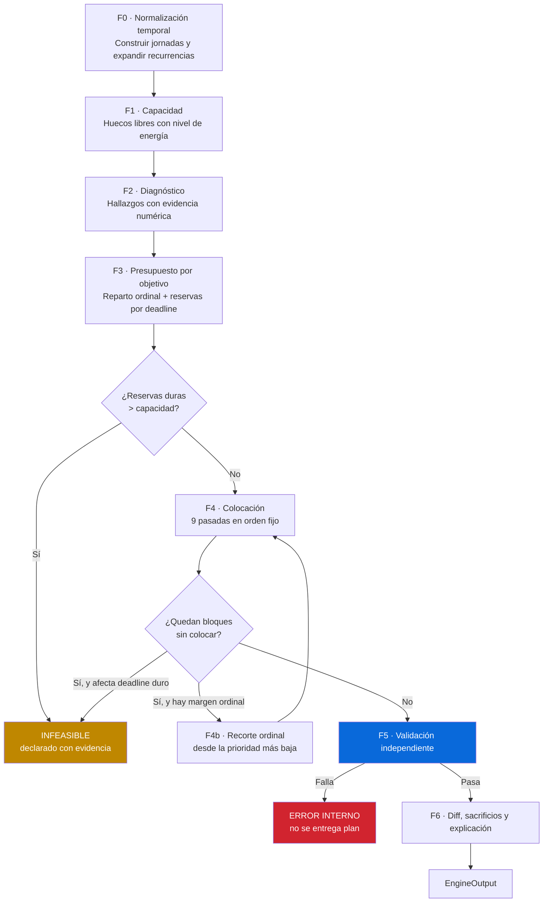

# 03 — Motor de planificación

Fecha: 2026-07-24
Decisiones de soporte: [ADR-004](./adr/ADR-004-motor-determinista-vs-llm.md), [ADR-006](./adr/ADR-006-versionado-de-plan-y-diff.md), [ADR-013](./adr/ADR-013-motor-como-funcion-pura.md)

> Este es el documento de referencia para implementar `packages/engine`. Todo lo que
> aparece aquí es determinista: misma entrada, misma salida, byte a byte.

---

## 1. Contrato

```ts
function runEngine(input: EngineInput): EngineOutput;   // pura, sin I/O, sin reloj
```

```ts
interface EngineInput {
  now: Instant;                       // INYECTADO. El motor nunca llama al reloj
  window: { start: Instant; end: Instant };
  regeneratedFrom: Instant;           // frontera de inmutabilidad del pasado
  profile: TemporalProfile;
  energyWindows: EnergyWindow[];
  dayExceptions: DayException[];
  capacityModifiers: CapacityModifier[];
  timezoneOverrides: TimezoneOverride[];
  commitments: MaterializedCommitment[];   // recurrencias YA expandidas por packages/temporal
  wellbeing: WellbeingCommitment[];
  goals: Goal[];                           // con rank_ordinal, orden total garantizado
  tasks: Task[];
  externalWindows: ExternalWindow[];
  previousVersion?: MaterializedVersion;   // para linaje y diff
  userOverrides: UserOverride[];
  adherenceStats: AdherenceStats;          // agregados, no registros crudos
  params: EngineParams;                    // constantes calibrables, explícitas
}

interface EngineOutput {
  capacity: CapacityReport;
  diagnosis: Finding[];
  feasibility: 'FEASIBLE' | 'INFEASIBLE';
  infeasibilityReasons: InfeasibilityReason[];
  blocks: PlacedBlock[];
  budgets: GoalBudget[];
  sacrifices: Sacrifice[];
  unplaced: UnplacedItem[];
  diff?: PlanDiff;
  trace: DecisionTrace;               // razón de CADA decisión. Ver §6
  validation: ValidationReport;
}
```

Dos exigencias del contrato que no son negociables:

- **`now` es un parámetro.** Ninguna línea del motor puede llamar a `Date.now()`. Es lo que
  permite probar "es miércoles y hay que replanificar lo que queda" sin manipular el reloj
  del sistema.
- **`params` es explícito.** Ninguna constante mágica enterrada en el código. Todos los
  números calibrables (porcentaje de fricción, pesos del ranking, duración mínima de bloque)
  viajan en la entrada, lo que permite barrer configuraciones en tests y ajustarlas por
  usuario más adelante sin tocar el motor.

---

## 2. Vista general de las fases



Nótese que **`INFEASIBLE` y el error interno son salidas distintas**. La primera es un
resultado legítimo del producto; la segunda es un fallo del software. Confundirlas es el
error de diseño que lleva a "generar un calendario que fracasará".

---

## 3. F1 — Cálculo de capacidad

### 3.1 Construcción de jornadas

```
función construirJornadas(ventana, perfil, excepcionesDia, overridesZona):
    jornadas = []
    para cada fecha local d en ventana:
        zona    = zonaEfectivaEn(d, overridesZona, perfil.baseTimezone)
        wake    = instante(d,    excepcionDe(d)?.wakeLocal  ?? perfil.defaultWakeLocal,  zona)
        wakeSig = instante(d+1,  excepcionDe(d+1)?.wakeLocal ?? perfil.defaultWakeLocal, zona)
        sleep   = instante(d,    excepcionDe(d)?.sleepLocal ?? perfil.defaultSleepLocal, zona)
        si sleep <= wake:  sleep = sleep + 1 día     // cruza medianoche: caso NORMAL
        jornadas.push({ id: índice, wake, sleep, wakeSig,
                        vigilia:  sleep - wake,      // duración REAL, tolera DST
                        sueño:    wakeSig - sleep })
    devolver jornadas
```

Todo el manejo de medianoche vive en la línea `si sleep <= wake`. A partir de ahí, ninguna
otra parte del motor vuelve a razonar sobre horas locales: opera con instantes absolutos.
Ese confinamiento es intencional — es la única forma de que los bugs de medianoche no se
repartan por todo el código.

**Aritmética del sueño como restricción dura:**

```
déficitSueño(j) = max(0, perfil.sleepNeedMinutes − duración(j.sueño))
si déficitSueño(j) > 0:
    j.prohibeFocoNocturno = true          // sin bloques de foco en el último tramo
    j.techoEnergía = NEUTRAL              // nada alcanza PEAK ese día
    emitir Finding SLEEP_DEBT con evidencia { requerido, real, déficit }
```

La consecuencia práctica: **el motor no puede resolver un déficit de sueño quitando sueño.**
Es la única restricción del sistema que nunca cede, ni siquiera ante un deadline duro. Si el
deadline solo cabe sacrificando sueño, el resultado correcto es `INFEASIBLE`.

### 3.2 Huecos libres con nivel de energía

```
función calcularHuecos(jornada, compromisos, transiciones, bienestarFijo):
    ocupado = []
    para cada compromiso c en jornada:
        ocupado.push(intervalo(c))
        para cada transición t de c aplicable a c.modalidad:
            ocupado.push(intervaloDe(t, c))      // antes o después según el tipo
    huecos = restar(intervalo(jornada.wake, jornada.sleep), unir(ocupado))
    para cada hueco h:
        h.tier = nivelEnergía(h, franjasEnergía, jornada)
    devolver huecos
```

**Nivel de energía de un hueco** — aquí está la implementación del cronotipo y del arrastre:

```
función nivelEnergía(hueco, franjas, jornada):
    base = franjaQueContiene(hueco).tier         // PEAK | NEUTRAL | LOW
    // Arrastre de compromisos pesados (la variante "persona que imparte clases")
    para cada compromiso c con energyCost = HIGH que termina antes del hueco:
        si hueco.inicio < c.fin + c.drainsAfterMinutes:
            base = degradar(base)                // PEAK->NEUTRAL, NEUTRAL->LOW
    // Deuda de sueño
    si jornada.techoEnergía:  base = min(base, jornada.techoEnergía)
    // Modificador de capacidad declarado por el usuario
    si modificadorActivo(hueco) = NONE:      devolver SIN_FOCO
    si modificadorActivo(hueco) = REDUCED:   base = min(base, LOW)
    devolver base
```

El cronotipo no aparece en ningún `if`. Un pico a las 05:00 y uno a las 23:00 recorren
exactamente el mismo camino. **Eso es la garantía estructural de que el motor no favorece al
madrugador**, y es verificable con un test: espejar todas las franjas de un caso y comprobar
que la calidad de la asignación es equivalente.

### 3.3 Capacidad asignable

```
brutoAsignable(j) = suma(duración de huecos con tier != SIN_FOCO)
fricción(j)       = brutoAsignable(j) × params.friccionBasePct
                  + númeroDeTransiciones(j) × params.friccionPorTransiciónMin
capacidad(j)      = brutoAsignable(j) − mantenimientoPersonal(j) − fricción(j)
```

**Por qué la fricción tiene dos términos.** Un porcentaje fijo trata igual un día de una sola
reunión y un día de seis, cuando el segundo es mucho más costoso: cada cambio de contexto
tiene un coste que no está en el calendario. El término por transición captura eso.

**Valores: 15 % + 7 min por transición** (Q6, resuelta el 2026-07-28). Se eligió la banda
conservadora deliberadamente: el brief establece que el incumplimiento es señal de mala
calibración y no falla del usuario, y de ahí se sigue que **un plan que promete de menos y se
cumple construye confianza, mientras que uno que promete de más colapsa**. Siguen siendo
suposiciones informadas, no datos, y por eso viven en `params`. Ver
[ADR-015](./adr/ADR-015-parametros-de-calibracion.md), que incluye el análisis numérico sobre
dos perfiles y el efecto de umbral que estos valores producen en los días apretados.

`capacidad(j)` es un **techo duro**: ninguna pasada de colocación puede superarlo. Es lo que
implementa el anti-requisito "no llenar cada minuto disponible", que es crítico en el caso
freelance donde el día está casi vacío y la tentación algorítmica es rellenarlo.

---

## 4. F2 — Diagnóstico

El diagnóstico se calcula **antes** de colocar nada y no depende de la colocación. Esa
independencia es lo que permite entregarlo con la entrevista a medias (regla nº5 del brief y
anti-requisito nº4).

Cada hallazgo es un objeto tipado con evidencia numérica, nunca una cadena de texto:

```ts
interface Finding {
  code: FindingCode;
  severity: 'INFO' | 'WARNING' | 'CRITICAL';
  evidence: Record<string, number | string>;   // la interfaz redacta desde aquí
}
```

| Código | Cálculo | Corresponde a la causa del brief |
|---|---|---|
| `PEAK_HOURS_OCCUPIED` | `minutosPicoOcupadosPorFijos / minutosPicoTotales` | Causa 1: las mejores horas ocupadas |
| `GOALS_EXCEED_CAPACITY` | `objetivosActivos × bloqueMinUtil × frecMin` vs `capacidadSemanal` | Causa 2: más objetivos que capacidad |
| `CAPACITY_GAP` | capacidad real vs. capacidad ingenua (`vigilia − trabajo`) | Causa 3: nunca calculó su capacidad |
| `TRANSITION_LOAD` | `minutosTransición / minutosVigilia` | Coste invisible de los traslados |
| `SLEEP_DEBT` | jornadas con `déficitSueño > 0` | Restricción dura violada |
| `NO_PROTECTED_WELLBEING` | bienestar declarado sin hueco viable | Regla nº4 |
| `FRAGMENTATION_RISK` | huecos < bloque mínimo útil / huecos totales | Fragmentos inútiles |
| `DEADLINE_AT_RISK` | trabajo restante vs. capacidad hasta la fecha | Anticipa `INFEASIBLE` |

`CAPACITY_GAP` merece una nota: la "capacidad ingenua" (vigilia menos trabajo) es una
aproximación deliberadamente ingenua que sirve **solo** para el contraste narrativo —
"creías tener 40 horas; tienes 22". No se usa en ningún cálculo de planificación. Que sea
una aproximación tosca es aceptable porque su función es retórica, no operativa; conviene
que quien lo implemente lo sepa para no "mejorarla".

---

## 5. F3 y F4 — Presupuesto y colocación

### 5.1 Presupuesto por objetivo

Orden de reparto, estricto:

```
1. RESERVAS POR DEADLINE DURO (antes de cualquier reparto)
   para cada objetivo g con deadline HARD dentro del horizonte:
       requerido(g) = trabajoRestante(g)
       disponible   = capacidadTotal hasta g.deadline
       reserva(g)   = requerido(g)              // se reserva ÍNTEGRO
   si suma(reservas) > capacidadTotal:
       -> INFEASIBLE  con InfeasibilityReason HARD_DEADLINE_UNREACHABLE
          por cada objetivo, con { requerido, disponible, déficit }
       -> SE DETIENE AQUÍ. No se genera un plan que fracasará.

2. CONTACTO DIARIO DE LA PRIORIDAD #1
   reserva(g1) += params.contactoDiarioMin × númeroDeJornadas

3. REPARTO ORDINAL DEL REMANENTE
   restante = capacidadTotal − suma(reservas)
   peso(g)  = 1 / rank_ordinal(g)               // serie armónica
   presupuesto(g) = reserva(g) + restante × peso(g) / suma(pesos)

4. FILTRO DE VIABILIDAD  <-- la regla más importante de esta fase
   para cada objetivo g en orden ordinal DESCENDENTE (del menos prioritario hacia arriba):
       si presupuesto(g) < params.bloqueMinUtilMin:      // por defecto 60
           presupuesto(g) = 0
           registrar Sacrifice { g, minutos, reason: BELOW_MIN_BLOCK }
           redistribuir esos minutos hacia los objetivos de mayor rango

5. GARANTÍA DE BLOQUE LARGO PARA PRIORIDADES BAJAS   // ADR-015
   para cada objetivo g con rank(g) > 3 y presupuesto(g) > 0:
       consolidar su presupuesto en el MENOR número de bloques posible,
       cada uno >= params.bloqueLargoMin (90),
       marcados para colocarse en las jornadas de MAYOR capacidad libre
       si no cabe ni un bloque de 90 min:
           presupuesto(g) = 0
           registrar Sacrifice { g, minutos, reason: BELOW_LONG_BLOCK }
```

**El paso 4 es la traducción algorítmica de la causa nº2 del brief.** Si un objetivo no
alcanza para un bloque útil, el sistema **no lo fragmenta: lo deja fuera y lo dice**. Es
exactamente lo contrario del comportamiento por defecto de un repartidor proporcional, que
daría 20 minutos a cada uno y produciría los "fragmentos inútiles" que el brief identifica
como el problema.

> **Corrección del 2026-07-28.** Al resolverse Q5 se afirmó que este filtro produce un tope
> de "3–4 objetivos en una capacidad típica". **Es falso.** El filtro compara el presupuesto
> *total de la ventana* contra 60 min, y con 14 días y ~3000 min de capacidad hasta el
> objetivo de rango 5 recibe más de 200 min: casi nunca corta.
>
> **El tope emergente lo produce otro mecanismo:** lo que escasea no son los minutos sino las
> **plazas de colocación**, limitadas por la capacidad diaria y por el tope de 3 temas de foco
> al día. Contando plazas reales en un perfil de empleo híbrido salen ~22 en 14 días, y el
> corte cae **entre 8 y 10 objetivos**, no en 3–4. La dispersión diaria —que es la métrica del
> brief— la controla el tope de temas por día, no este filtro.
> Análisis completo en [ADR-015](./adr/ADR-015-parametros-de-calibracion.md).

**El paso 5 convierte en garantía lo que antes era una propiedad emergente.** La regla del
brief *"las prioridades bajas reciben bloques largos e infrecuentes"* dependía de que el
reparto cayera de forma favorable. Ahora se fuerza: el presupuesto de un objetivo de rango
bajo se consolida en pocos bloques grandes, o no se le da nada y se explica por qué. Nunca se
reparte en fragmentos diarios.

**Regla de forma por rango**, que orienta la consolidación:

```
frecuenciaObjetivo(g) = rank(g) == 1  ->  diaria (contacto) + 2-3 bloques de foco
                        rank(g) <= 3  ->  2-3 bloques de foco por semana
                        rank(g) >  3  ->  1 bloque LARGO por semana (>= 90 min), o cero
```

### 5.2 Orden de colocación

El orden es fijo y no configurable. Cada pasada solo puede usar huecos que dejaron las
anteriores.

| # | Pasada | Regla del brief que implementa |
|---|---|---|
| 1 | Compromisos fijos + sus transiciones | Ya son inmovibles; definen los huecos |
| 2 | **Tareas con ventana externa obligatoria** | "se colocan primero, junto con los compromisos fijos" |
| 3 | Bloques `PIN` del usuario | Regla nº7: la sobrescritura manda |
| 4 | Innegociables de bienestar | Regla nº4: bloque protegido, no relleno |
| 5 | Estructura obligatoria de la semana | Captura/admin, buffer, revisión, planeación |
| 6 | Foco de objetivos con deadline duro | Urgencia real; mejor hueco disponible |
| 7 | Contacto diario de la prioridad #1 | "recibe contacto diario aunque sea breve" |
| 8 | Foco del resto, por orden ordinal | Reparto ordinal |
| 9 | Seguimientos cortos (bloqueados por terceros) | "seguimiento corto, no trabajo profundo" |
| 10 | Designación del amortiguador | "se mueve dentro del día, no se cancela" |

Justificación del orden: **primero lo que tiene menos grados de libertad**. Una tarea que
solo puede hacerse martes de 9 a 14 en una oficina tiene un espacio de soluciones minúsculo;
si se coloca tarde, no cabe. El trabajo de foco, en cambio, admite muchos huecos. Es la
heurística clásica de *most-constrained-first*, y es lo que hace innecesario un backtracking
caro.

El bienestar va en la posición 4, **antes que cualquier trabajo**. Si fuera después, en una
semana apretada se quedaría sin sitio, que es la definición de "relleno".

### 5.3 Elección de hueco: función de puntuación

```
función mejorHueco(bloque, huecosDisponibles, estadoDelDía):
    candidatos = huecosDisponibles.filtrar(h => cumpleRestriccionesDuras(bloque, h, estadoDelDía))
    si candidatos vacío: devolver NO_CABE
    devolver max(candidatos, por puntuación) con desempate determinista
```

**Restricciones duras (filtro binario, no puntuación):**

```
1. duración(h) >= duraciónRequerida(bloque)
2. bloque.kind = FOCUS  =>  duración >= params.bloqueMinUtilMin (60)
3. temasDeFocoDistintosEn(día) + (bloque introduce tema nuevo ? 1 : 0)
       <= perfil.maxFocusTopicsPerDay
4. minutosUsados(día) + duración(bloque) <= capacidad(día)
5. h.tier != SIN_FOCO  si bloque requiere foco
6. jornada.prohibeFocoNocturno  =>  bloque FOCUS no puede caer en el último tramo
7. hay hueco para las transiciones respecto a los bloques vecinos
8. si bloque tiene ventana externa: h está dentro de esa ventana
```

**Puntuación (todo lo demás):**

```
puntuación(bloque, h) =
      W_ENERGÍA     × ajusteEnergía(bloque.necesidad, h.tier)     // término dominante
    − W_FRAGMENTO   × residuoInútil(h, bloque)      // penaliza dejar restos < 60 min
    + W_CONTIGÜIDAD × contiguoConMismoObjetivo(h)   // menos cambios de contexto
    − W_ARRASTRE    × proximidadACompromisoPesado(h)
    − W_DISPERSIÓN  × objetivosYaTocadosEseDía      // empuja hacia la métrica de éxito
    + W_URGENCIA    × cercaníaDelDeadline(bloque)

ajusteEnergía:  FOCUS profundo    -> PEAK=3, NEUTRAL=1, LOW=-2
                ADMIN / reactivo  -> LOW=3,  NEUTRAL=1, PEAK=-3   // ¡negativo!
                bienestar         -> según preferred_tier
```

El valor **negativo** de colocar trabajo administrativo en la franja pico es deliberado: no
basta con preferir el pico para el trabajo profundo, hay que **penalizar activamente** que lo
ocupe lo reactivo. Sin ese negativo, un día con abundante hueco pico se llena de correo, que
es la causa nº1 del brief.

`W_DISPERSIÓN` conecta el algoritmo con la métrica de éxito declarada (reducir objetivos
tocados por día). Es un caso raro y valioso de métrica de producto codificada directamente en
la función objetivo.

**Desempate determinista, sin aleatoriedad:** hueco más temprano en la jornada → jornada de
índice menor → `identity_key` lexicográficamente menor. Nunca se usa un generador aleatorio,
ni siquiera con semilla. Un motor con aleatoriedad sembrada sigue siendo frágil ante
reordenamientos de la entrada; el orden total explícito no.

### 5.4 Cuando algo no cabe: recorte ordinal, no búsqueda exhaustiva

```
función colocarConRecorte(bloques, huecos, presupuestos):
    para intento en 1..params.maxIntentosRecorte:          // por defecto 3
        resultado = colocarTodasLasPasadas(bloques, huecos)
        si resultado.sinColocar vacío: devolver resultado

        críticos = resultado.sinColocar.filtrar(b => b.objetivo.deadline == HARD)
        si críticos no vacío:
            // No se puede recortar lo que tiene deadline duro
            devolver INFEASIBLE con HARD_DEADLINE_UNREACHABLE por cada crítico

        // Recorte desde la prioridad MÁS BAJA hacia arriba (regla nº3)
        víctima = objetivoActivoDeMayorRankOrdinal(presupuestos)
        minutos = presupuesto(víctima)
        presupuesto(víctima) = 0
        registrar Sacrifice {
            goal: víctima, minutos, reason: ORDINAL_TRIM,
            evidence: { intento, bloquesSinColocar, capacidadDisponible }
        }
        bloques = regenerarBloquesDesde(presupuestos)

    devolver INFEASIBLE con CAPACITY_STRUCTURALLY_INSUFFICIENT
```

**Por qué no hay backtracking exhaustivo ni un solver de restricciones.** Se evaluó modelar
esto como CSP/ILP con OR-Tools. Se descarta por tres razones concretas:

1. **La explicabilidad es el producto.** Un solver devuelve una solución óptima sin decir por
   qué sacrificó lo que sacrificó. La regla nº2 y nº3 del brief exigen justamente esa
   narrativa, y reconstruirla desde un solver es un problema abierto.
2. **La optimalidad no es el requisito.** El usuario no necesita el mejor plan posible;
   necesita un plan honesto que respete el orden de prioridades. Un greedy con recorte
   ordinal produce exactamente eso, y la diferencia de calidad frente al óptimo es
   irrelevante frente al error de las estimaciones de entrada, que es de decenas de minutos.
3. **Coste y determinismo.** Un solver añade una dependencia nativa pesada y tiempos de
   ejecución con cola larga.

Si más adelante aparecen instancias que el greedy resuelve mal, el punto de extensión es
sustituir la fase 4 dejando intactas las demás — es una decisión reversible por diseño.

---

## 6. F6 — Explicación de cada colocación e intercambio

### 6.1 La traza se emite al decidir, nunca se reconstruye

Cada bloque colocado lleva su `rationale` estructurado, escrito en el momento de la decisión:

```jsonc
{
  "chosenSlot":  { "start": "...", "tier": "PEAK" },
  "reasonCode":  "BEST_ENERGY_MATCH",
  "score":       7.4,
  "runnerUp":    { "start": "...", "tier": "NEUTRAL", "score": 3.1 },
  "constraints": ["MIN_BLOCK_60", "MAX_TOPICS_3", "TRANSITION_20_BEFORE"],
  "displaced":   [{ "lineageId": "...", "goalId": "...", "minutes": 60 }]
}
```

`runnerUp` es lo que permite responder la pregunta que el usuario realmente hace: *"¿por qué
aquí y no el martes?"* — "el martes tu franja pico ya tenía dos temas de foco". Reconstruir
esa respuesta después de haber decidido es imposible: la información del segundo mejor
candidato solo existe durante la comparación.

### 6.2 Redacción del texto

La explicación mostrada se compone con **plantillas deterministas** sobre `reasonCode` y
`evidence`:

```
ORDINAL_TRIM     -> "Se retiró {minutos} de «{objetivo}» (prioridad #{rank}) porque
                     {objetivoGanador} tiene fecha límite el {fecha} y necesitaba
                     {minutosNecesarios} más."
BELOW_MIN_BLOCK  -> "«{objetivo}» solo alcanzaba {minutos} esta semana. Menos de
                     {mínimo} minutos no produce avance, así que queda fuera en vez de
                     repartirse en fragmentos."
```

El LLM, cuando se active, **solo reescribe estas plantillas ya rellenas** para hacerlas más
naturales. Nunca genera la explicación desde los datos crudos, porque entonces podría
inventar una causa. Ver [ADR-004](./adr/ADR-004-motor-determinista-vs-llm.md).

**El motor emite `narrativeCode` + `narrativeParams`, nunca texto redactado** (desde el
2026-07-27, [ADR-014](./adr/ADR-014-cumplimiento-rgpd.md)). Los parámetros referencian
objetivos y tareas **por id**; el motor no conoce los títulos y no debe recibirlos. Un título
copiado dentro de una narrativa persistida sobreviviría al borrado de su objetivo y rompería
el derecho de supresión. La composición del texto ocurre al leer, fuera del motor.

### 6.3 Cálculo del diff

```
función calcularDiff(anterior, nueva):
    // NIVEL 1 — exacto, sin heurística. Es la fuente de verdad de la regla nº2.
    para cada objetivo g en union(objetivos(anterior), objetivos(nueva)):
        antes   = suma minutos de bloques de g en anterior
        después = suma minutos de bloques de g en nueva
        veredicto = clasificar(antes, después)   // GAINED/LOST/UNCHANGED/DROPPED/INTRODUCED
        emitir GoalDelta

    // NIVEL 2 — detalle por bloque, usando linajes YA asignados en la colocación
    porLinaje = indexar(anterior.bloques, nueva.bloques) por lineage_id
    para cada linaje:
        si solo en nueva:                      ADDED
        si solo en anterior:                   REMOVED
        si en ambos y cambió el inicio:        MOVED
        si en ambos y cambió la duración:      RESIZED
        si en ambos y cambió el tier:          RETIERED

    // TITULAR: se construye desde el nivel 1, nunca desde el 2
    ganadores = deltas con verdict GAINED ordenados por delta desc
    perdedores= deltas con verdict LOST|DROPPED ordenados por delta asc
    headlineCode   = "GAIN_LOSS"
    headlineParams = { gainedGoalId, gainedMinutes, lostGoalId, lostMinutes }
    // El texto "Ganas 3 h en «X»..." se compone AL LEER, fuera del motor.
```

**El titular se construye desde el nivel agregado**, que es aritmética exacta. Si se
construyera desde los eventos de bloque, dependería del emparejamiento por linaje y podría
mentir en casos raros. Esta separación es la que permite afirmar sin matices que ningún
intercambio es silencioso.

**Invariante testeable:**
`∀g: delta_minutes(g) == minutos(g, nueva) − minutos(g, anterior)`. Property-based test
obligatorio.

---

## 7. F5 — Validación con verificador independiente

```
función validar(salida, entrada) -> ValidationReport:
    afirmar sinSolapes(salida.bloques)
    afirmar transicionesRespetadas(salida.bloques, entrada.commitments)
    afirmar ∀ jornada: minutosUsados <= capacidad(jornada)
    afirmar ∀ bloque FOCUS: duración >= params.bloqueMinUtilMin
    afirmar ∀ jornada: temasDeFocoDistintos <= perfil.maxFocusTopicsPerDay
    afirmar ∀ bloque: tiene exactamente 0 o 1 vínculo de contenido   // un bloque, un objetivo
    afirmar ∀ jornada con déficit de sueño: sin bloques FOCUS nocturnos
    afirmar bienestarDeclarado ⊆ bienestarColocado ∪ sacrificiosExplicados
    afirmar estructuraSemanal presente (captura, buffer, revisión, planeación)
    afirmar exactamente un bloque con is_shock_absorber por jornada con foco
    afirmar ∀ objetivo con deadline HARD: minutosAsignados >= minutosRequeridos
    afirmar ∀ bloque anterior a entrada.regeneratedFrom: idéntico al de la versión padre
```

**Regla de implementación, y es la parte importante de esta sección:** este módulo
**no importa nada de la fase de colocación**. Reimplementa sus propios cálculos de solape y
de capacidad desde los datos de la salida. Se paga duplicación a propósito. Si compartiera
la utilidad `solapan()` con el colocador, un bug en esa utilidad haría que la validación
pasara siempre — el chequeo se volvería una tautología y la garantía sería falsa.

Si la validación falla, **no se entrega plan**: es un error interno con alerta. La tasa de
fallo del validador es una métrica de calidad que debe ser exactamente cero en producción.

---

## 8. Casos difíciles y cómo se resuelven

### 8.1 Compromiso que expira y libera un hueco

Es una variante que el brief destaca y que muchos diseños tratan como caso especial. Aquí
**no requiere código específico**:

1. `recurrence_rules.effective_until` hace que la expansión deje de producir instancias.
2. La siguiente generación ve más huecos libres, sin más.
3. El reparto ordinal asigna ese excedente por peso, es decir, mayoritariamente a la
   prioridad más alta.
4. El diff lo declara: `GAINED` para el objetivo beneficiado.

Lo único que hace falta es un **disparador**: un trabajo diario que detecte reglas que
expiraron desde la última generación y sugiera replanificar con
`reason = 'COMMITMENT_EXPIRED'`. Es el único componente programado del sistema y su
justificación es exactamente esta variante.

### 8.1b Semana atípica dentro de la ventana (viaje, vacaciones)

Se planifica **la ventana completa de 14 días**, tratando el periodo atípico como una
anulación de disponibilidad. No se corta el plan en el evento (Q11, resuelta el 2026-07-28).

La razón no es de preferencia sino de regla innegociable: **si el plan se cortara en el
viaje, el sistema no podría detectar que un deadline posterior al viaje es inalcanzable**, y
callaría en vez de declararlo. Eso incumpliría directamente la regla nº6 del brief ("un plan
imposible se declara imposible"). La detección de inviabilidad exige mirar toda la ventana,
incluidos los días al otro lado del hueco.

Los días posteriores al periodo atípico se planifican con la información disponible y se
replanifican al volver, con `reason = 'CONSTRAINT_CHANGE'`.

### 8.2 Cambio a mitad de semana

`regeneratedFrom = now`. Los bloques anteriores se copian textualmente de la versión padre
(el validador lo comprueba). El motor solo coloca desde `now`. El diff compara las versiones
completas, así que la parte pasada aparece como `UNCHANGED` y el usuario ve únicamente el
intercambio real sobre los días que quedan.

### 8.3 Turnos rotativos

No hay caso especial. `packages/temporal` expande el generador `CYCLE` y el motor recibe una
lista de compromisos materializados como cualquier otra. **La complejidad del turno rotativo
está toda en la expansión, no en la planificación.** Ese confinamiento es el objetivo de
diseño: si el motor tuviera que saber qué es un turno, cada regla nueva tendría que
contemplarlo.

### 8.4 Freelance con exceso de capacidad

El riesgo aquí es opuesto y el motor lo resuelve por construcción:

- El techo de `capacidad(j)` impide llenar el día.
- El tope de temas de foco por día impide la dispersión.
- Los presupuestos por objetivo se topan con lo que el objetivo realmente necesita
  (`min(presupuesto, trabajoRestante)`), así que no se inventa trabajo.
- Si sobra capacidad tras cubrir todo, **el motor deja el hueco vacío** y emite un
  `Finding` de tipo `SPARE_CAPACITY`. No lo rellena. Anti-requisito nº1.

### 8.5 Tarea urgente de aparición súbita

Entra como replanificación parcial con `reason = 'URGENT_TASK'`. Compite en la pasada 6 si
tiene deadline duro. El diff muestra qué desplazó. Si desplaza un bienestar protegido, **no
se coloca** y el sistema propone `INFEASIBLE` parcial o recorte de un objetivo bajo — la
decisión la toma el usuario.

### 8.6 El bloque amortiguador

Se designa al final: dentro de cada jornada con foco, el bloque de menor rango ordinal que no
sea bienestar ni tenga deadline duro recibe `is_shock_absorber = true`. Su semántica ("se
mueve dentro del día, no se cancela") es una regla de la interfaz al arrastrar, no del motor,
pero el motor la marca.

---

## 9. Recalibración con datos reales

**En el primer entregable la recalibración es asistida, no automática.** Ver la justificación
del diferimiento en [00 §3.3](./00-vision-y-alcance.md): ajustar estimaciones con dos semanas
de datos produce ruido con apariencia de inteligencia.

Lo que sí entra desde el día uno es la **captura** (irreversible si se pierde) y la
**detección**, mostrada en la revisión semanal como propuesta que el usuario acepta o
rechaza:

```
señal SOBRE_DURACIÓN_SISTEMÁTICA:
    si ≥ 3 registros del mismo objetivo con outcome = OVERRAN
       y mediana(real/planificado) > 1.25:
    -> proponer: "Los bloques de «X» duran un 30 % más de lo estimado.
                  ¿Ajusto la estimación a {nuevo}?"

señal HORARIO_INCUMPLIDO:
    si ≥ 3 registros del mismo lineage_id con outcome ∈ {MOVED, CANCELLED}:
    -> proponer: "El bloque de los martes a las 07:00 se movió 4 de 5 veces.
                  ¿Lo cambio a {alternativa con mejor histórico}?"
    // el brief: "propone moverlo en vez de insistir"

señal FRANJA_PICO_EQUIVOCADA:
    si cumplimiento en franja PEAK declarada < cumplimiento en otra franja,
       con ≥ 10 registros:
    -> proponer revisar la franja de mayor rendimiento
```

Umbrales (3 registros, 1.25, 10 registros) son **suposiciones iniciales** que viven en
`params`. Se validan con datos, no con opinión.

Cuando se automatice, el requisito de diseño es que **cada ajuste automático debe ser
visible y reversible en la revisión semanal**. Un motor que cambia sus estimaciones en
silencio viola el mismo principio que "ningún intercambio es silencioso".

---

## 10. Testing determinista del motor

Esta sección es normativa para la implementación.

### 10.1 Golden tests: la §5 del brief como suite ejecutable

Un fixture por variante, en `packages/engine/fixtures/`:

```
fixtures/
  01-horario-fijo-oficina/            input.json  expected.json
  02-hibrido-dias-variables/
  03-multiples-empleos/
  04-turno-rotativo-4x3/
  05-freelance-sin-horario/
  06-imparte-clases-arrastre/
  07-busqueda-de-empleo/
  08-cronotipo-nocturno-22-01/
  09-cronotipo-madrugador-05-08/      <- espejo de 08: la asignación debe ser equivalente
  10-compromiso-que-expira/
  11-ventana-externa-tramite/
  12-bloqueado-por-terceros/
  13-semana-atipica-viaje/
  14-energia-reducida/
  15-cambio-a-mitad-de-semana/
  16-tarea-urgente-subita/
  17-plan-imposible-deadline/
  18-deficit-de-sueno/
  19-muchos-objetivos-tope-emergente/   <- 10+ objetivos: fija dónde corta DE VERDAD
  20-prioridad-baja-bloque-largo/       <- rank > 3 recibe >= 90 min, o se explica
```

**Los fixtures 19 y 20 se añadieron el 2026-07-28** con
[ADR-015](./adr/ADR-015-parametros-de-calibracion.md). El 19 existe porque la caracterización
del tope emergente resultó ser errónea, y el comportamiento real debe quedar fijado por un
caso ejecutable en lugar de por una frase en un documento. El 20 protege la regla de las
prioridades bajas, que hasta entonces dependía de una propiedad emergente.

**Todos los fixtures de capacidad deben generarse con 15 % + 7 min**; cualquiera calculado
con los valores antiguos (12 % + 5) está mal.

Cada fixture es un contrato: si el comportamiento cambia, el diff del `expected.json` muestra
exactamente qué cambió y obliga a decidir si es una mejora o una regresión. **Es el mecanismo
que convierte la sección 5 del brief en algo verificable en vez de aspiracional.**

El par 08/09 es el test antisesgo: mismo escenario con las franjas espejadas debe producir la
misma calidad de asignación (mismos minutos de foco en PEAK, mismo número de sacrificios).

### 10.2 Property-based testing de los invariantes

Con `fast-check`, generando entradas válidas arbitrarias:

```
∀ entrada válida, salida = runEngine(entrada):
  P1  ningún par de bloques se solapa
  P2  ningún día excede su capacidad calculada
  P3  todo bloque FOCUS dura >= 60 min
  P4  ningún día tiene más de maxFocusTopics temas de foco distintos
  P5  todo bloque tiene como máximo un vínculo de contenido
  P6  todo bienestar declarado está colocado o tiene un sacrificio que lo explica
  P7  si feasibility = FEASIBLE, todo deadline duro tiene sus minutos
  P8  ∀ objetivo: diff.delta == minutos(nueva) − minutos(anterior)
  P9  runEngine(x) == runEngine(x)                      // determinismo estricto
  P10 runEngine(x) == runEngine(permutarOrdenDeEntrada(x))   // independencia del orden
  P11 los bloques anteriores a regeneratedFrom son idénticos a los de la versión padre
  P12 sacrificios ordenados por rank descendente: nunca se recorta a #1 antes que a #4
  P13 todo objetivo con rank > 3 y presupuesto > 0 recibe al menos un bloque de
      >= bloqueLargoMin (90 min), o un Sacrifice BELOW_LONG_BLOCK que lo explique.
      Nunca recibe fragmentos diarios.   // ADR-015
```

P10 es el que caza la clase de bug más traicionera: un motor que depende del orden de llegada
de los objetivos en un array produce planes distintos ante los mismos datos y hace imposible
depurar una queja.

P12 codifica la regla nº3 del brief como propiedad matemática.

P13 es la red de seguridad de la regla "las prioridades bajas reciben bloques largos e
infrecuentes". Antes dependía de que el reparto cayera bien; ahora es verificable. Es también
el test que detectaría una regresión si alguien subiera la fricción sin darse cuenta de que
deja a los objetivos bajos sin sitio.

### 10.3 Aritmética temporal

Suite dedicada en `packages/temporal`, con casos reales:

- Día de cambio de horario de 23 h y de 25 h (con zonas que aún aplican DST).
- Sueño que cruza medianoche, y jornada que cruza cambio de horario.
- Cronotipo con pico 22:00–01:00 (el pico cruza medianoche).
- Excepción de recurrencia en el día del cambio de horario.
- Zonas con desfase no entero (`Asia/Kolkata`, +05:30) y con cambios históricos.
- Año bisiesto y semana 53.

Se usa un huso con DST real, no un huso fijo, para que las pruebas se parezcan al mundo.

### 10.4 Regla de disciplina

`packages/engine` y `packages/temporal` no pueden tener dependencias de I/O en su
`package.json`. Un test de arquitectura lo verifica. Es la salvaguarda mecánica de todo lo
anterior: sin ella, el determinismo dura hasta la primera fecha de entrega apretada.
