# 05 — Plan de implementación

Fecha: 2026-07-24

> Cada fase tiene: **qué entrega**, **criterio de aceptación observable** (verificable por
> alguien que no escribió el código) y **qué desbloquea**. Las fases están ordenadas por
> reducción de riesgo, no por comodidad.

---

## 0. El orden y por qué es ese

El riesgo del proyecto no está repartido de forma uniforme. Está concentrado en dos sitios:

1. **La aritmética temporal.** Los bugs de zonas horarias y medianoche son silenciosos,
   aparecen en producción con datos reales y son carísimos de corregir tarde porque
   contaminan datos ya guardados.
2. **El motor.** Es donde el producto puede resultar sencillamente no viable.

Por eso el plan **no** empieza por la pantalla de login ni por el CRUD. Empieza por el núcleo
temporal, sin interfaz, y sube desde ahí. La consecuencia incómoda es que no hay nada
demostrable hasta la fase 4. Se acepta a propósito: descubrir en la fase 6 que el modelo
temporal no soporta turnos rotativos costaría reescribir todo lo construido encima.

```mermaid
gantt
    dateFormat X
    axisFormat %s
    section Núcleo
    F0 Andamiaje            :f0, 0, 1
    F1 Núcleo temporal      :f1, after f0, 2
    F2 Esquema y persistencia :f2, after f1, 1
    section Producto
    F3 Motor - capacidad y diagnóstico :f3, after f2, 2
    F4 Motor - colocación y validación :f4, after f3, 3
    F5 Versionado y diff    :f5, after f4, 2
    F6 API y entrevista     :f6, after f5, 2
    F7 Interfaz             :f7, after f6, 3
    F8 Export y seguimiento :f8, after f7, 2
    F9 Endurecimiento       :f9, after f8, 1
```

Las duraciones son **relativas**, no compromisos de calendario. Q12 confirmó **una persona,
sin plazo externo**, pero la disponibilidad de horas sigue sin conocerse, así que las
duraciones siguen sin traducirse a fechas. Sirven para mostrar dónde está el peso.

### ¿Sigue siendo correcto este orden ahora que no hay plazo?

Sí, y con más razón: el único argumento para alterarlo era necesitar una demo temprana, y ese
argumento ha desaparecido.

**Pero el riesgo cambia de naturaleza y hay que decirlo.** Sin plazo y trabajando en solitario,
el riesgo deja de ser "no llegar a la fecha" y pasa a ser **abandono por falta de recompensa
visible**. Es el modo de fallo típico de los proyectos personales largos, y el plan actual no
enseña nada hasta la fase 4.

Mitigación, incorporada a la fase 3: **el diagnóstico debe poder verse sin esperar a la
interfaz.** Un comando que toma un fixture y escribe un informe legible es media jornada de
trabajo y adelanta la primera recompensa varias fases. No es una funcionalidad de producto:
es una herramienta de desarrollo que además sirve para depurar el motor.

**Lo que sí se simplifica al ser una sola persona:** los entornos de previsualización por rama
pierden buena parte de su sentido (no hay revisiones cruzadas), así que la fase 0 puede
quedarse solo con producción y desarrollo local, y añadirlos si algún día hay alguien más.

---

## Fase 0 — Andamiaje

**Entrega**
- Monorepo pnpm con la estructura de [01 §6](./01-arquitectura.md).
- TypeScript en modo `strict` con `noUncheckedIndexedAccess` y `exactOptionalPropertyTypes`.
- Biome (lint + formato, una sola herramienta), Vitest, `dependency-cruiser`.
- CI en GitHub Actions: typecheck, lint, tests, verificación del grafo de dependencias.
- `CLAUDE.md` del proyecto con lo propuesto en [07](./07-convenciones-propuestas.md).

**Criterio de aceptación**
- `pnpm verify` pasa en limpio en CI.
- **Un import de `drizzle-orm` dentro de `packages/engine` rompe el build.** Se comprueba
  añadiéndolo a propósito una vez y viendo fallar CI. Esta prueba es el objetivo real de la
  fase: sin ella, la frontera del motor es una intención y no una garantía.

**Desbloquea** todo. **Ya no está bloqueada**: Q1 se resolvió el 2026-07-27 como SaaS
multiusuario, así que la autenticación de [ADR-010](./adr/ADR-010-autenticacion.md) entra en
firme. Conviene resolver Q12 (tamaño de equipo y plazo) antes de cerrar esta fase, porque
podría reabrir la elección de stack de [ADR-001](./adr/ADR-001-stack-y-monorepo.md).

---

## Fase 1 — Núcleo temporal (`packages/temporal`)

La fase de mayor densidad de bugs potenciales por línea de código.

**Entrega**
- `PlanningDay`: construcción de jornadas `[wake, nextWake)` desde perfil + excepciones.
- Aritmética del sueño cruzando medianoche.
- Álgebra de intervalos: unión, resta, solape, huecos.
- Expansión de recurrencia: generador `RRULE` (subconjunto RFC 5545) y generador `CYCLE`.
- Aplicación de excepciones ancladas por instante original.
- Resolución de zona horaria con `timezone_overrides` y `anchor`.

**Dependencia externa:** `@js-temporal/polyfill` o `Temporal` nativo si el runtime lo
soporta; `rrule` para el subconjunto RFC 5545. **No** `moment`, **no** `date-fns` con zonas:
la aritmética de zonas necesita una biblioteca que trate instante, fecha civil y zona como
tipos distintos, que es justamente lo que evita la clase entera de errores de medianoche.

**Criterio de aceptación**
- Un turno rotativo 4×3 anclado el 2026-08-03 expande correctamente 8 semanas, y las semanas
  civiles resultantes **son distintas entre sí**.
- Una jornada que cruza un cambio de horario mide 23 h o 25 h reales, no 24.
- Un cronotipo con pico 22:00–01:00 produce una franja `PEAK` contigua que atraviesa
  medianoche, sin partirse en dos.
- Una excepción creada antes de un cambio de horario sigue apuntando a la instancia correcta
  después.
- Property test: `∀ jornada: sueño + vigilia == nextWake − wake`, exacto al minuto.
- Cobertura de ramas ≥ 95 % en este paquete (el único con umbral obligatorio).

**Desbloquea** el motor y la persistencia de recurrencias.

---

## Fase 2 — Esquema y persistencia

**Entrega**
- Migraciones Drizzle con el esquema de [02](./02-modelo-de-datos.md), incluida
  `btree_gist` y las constraints de exclusión.
- Repositorios con filtro obligatorio por `user_id`.
- Testcontainers con PostgreSQL real para la suite de integración.

**Criterio de aceptación**
- Insertar dos bloques solapados en la misma versión **falla a nivel de base de datos**.
- Insertar dos objetivos activos con el mismo `rank_ordinal` falla.
- Marcar dos versiones del mismo plan como `ACTIVE` falla.
- `DELETE FROM users` deja a cero todas las tablas: hay un test que las recorre y cuenta.
- Test que verifica que **`capacity_modifiers` no tiene ninguna columna de texto libre**
  (introspección del esquema). Suena excesivo hasta que alguien añade `reason` en un PR
  apurado; es la salvaguarda mecánica del [ADR-011](./adr/ADR-011-privacidad-por-diseno.md).

**Desbloquea** el API. **No bloquea** el motor: el motor no conoce la base de datos.

---

## Fase 3 — Motor: capacidad y diagnóstico

**Entrega**
- `computeCapacity`: jornadas, huecos, niveles de energía con arrastre, fricción.
- `diagnose`: los 8 `Finding` de [03 §4](./03-motor-de-planificacion.md) con evidencia.
- Los primeros fixtures: 01, 04, 05, 08, 09.
- **Un comando que renderiza el diagnóstico de un fixture en texto legible.** Herramienta de
  desarrollo, no producto: adelanta la primera recompensa visible varias fases y sirve para
  depurar el motor sin interfaz.

**Criterio de aceptación**
- **Ya hay valor demostrable sin plan.** Con un fixture de enfermera con turnos 4×3, el
  diagnóstico dice cuántas horas asignables tiene realmente por semana y qué porcentaje de su
  franja pico está ocupada. Se puede enseñar a un usuario y que le resulte útil.
- El fixture 09 (madrugador) produce la misma estructura de capacidad que el 08 (nocturno)
  con las franjas espejadas. **Test antisesgo**: si difieren, hay un `if` que favorece a un
  cronotipo.
- Un día con déficit de sueño queda marcado con `prohibeFocoNocturno` y `techoEnergía`.
- Un compromiso `HIGH` con arrastre de 90 min degrada la energía del hueco siguiente, y sin
  el arrastre no lo hace.

**Desbloquea** la fase 4 y —esto es lo importante— **una demo con valor real**. Si hubiera que
cortar el proyecto aquí, lo entregado ya resuelve la causa nº3 del brief.

---

## Fase 4 — Motor: presupuesto, colocación y validación

La fase de mayor riesgo técnico.

**Entrega**
- Reparto ordinal con reservas por deadline y **filtro de viabilidad del bloque mínimo**.
- Las 10 pasadas de colocación en orden fijo.
- Función de puntuación con desempate determinista.
- Recorte ordinal con registro de sacrificios.
- Declaración de `INFEASIBLE` con evidencia y sugerencias.
- **Validador independiente** (módulo separado, sin importar nada del colocador).
- Los 18 fixtures completos.

**Criterio de aceptación**
- Las 12 propiedades P1–P12 de [03 §10.2](./03-motor-de-planificacion.md) pasan con 1000
  casos generados cada una.
- El fixture 17 (deadline imposible) devuelve `INFEASIBLE` **y no genera bloques**. Es el test
  de la regla nº6: un motor que "hace lo que puede" aquí sería un fracaso silencioso.
- El fixture 05 (freelance) deja capacidad sin asignar y emite `SPARE_CAPACITY`. Test del
  anti-requisito nº1.
- P12: en todo escenario con recorte, el orden de los sacrificios sigue el rango descendente.
  Nunca se recorta al #1 antes que al #4.
- **P13**: todo objetivo de rango > 3 con presupuesto recibe al menos un bloque de ≥90 min, o
  un sacrificio `BELOW_LONG_BLOCK` que lo explique. Nunca fragmentos diarios.
- Fixture 19: con 10+ objetivos, el corte se produce donde predice [ADR-015] (por escasez de
  plazas de colocación, no por el filtro de presupuesto).
- La tasa de fallo del validador sobre los 1000 casos generados es **cero**.
- El motor resuelve una ventana de 14 días con 6 objetivos y 40 compromisos en < 500 ms.

**Desbloquea** el versionado y el producto entero.

**Riesgo y plan B.** Si el greedy con recorte produce planes visiblemente malos en varios
fixtures, el punto de extensión es la pasada 4 aislada: se puede sustituir por búsqueda local
sobre la solución greedy sin tocar capacidad, diagnóstico, validación ni diff. Es la razón por
la que las fases están separadas así.

---

## Fase 5 — Versionado, diff y explicación

**Entrega**
- Asignación de linaje **durante** la colocación (no emparejamiento a posteriori).
- Diff de dos niveles: agregado exacto por objetivo + eventos de bloque.
- Titular y narrativas por plantilla determinista.
- Replanificación parcial respetando `regeneratedFrom`.

**Criterio de aceptación**
- P8 (`delta == después − antes` para todo objetivo) pasa con 1000 casos.
- Fixture 15: replanificar el miércoles deja los bloques del lunes y martes **byte a byte
  idénticos**, y el diff los muestra como `UNCHANGED`.
- Un bloque desplazado tres días aparece como un único `MOVED`, no como `REMOVED` + `ADDED`.
  Es el test que demuestra que el linaje funciona.
- Fixture 10: al expirar un compromiso, el diff muestra `GAINED` en el objetivo de mayor
  rango, sin intervención manual.
- Toda `Sacrifice` tiene narrativa no vacía y evidencia numérica coherente.

**Desbloquea** la promesa central del producto.

---

## Fase 6 — API y entrevista

**Entrega**
- Autenticación por enlace de un solo uso y sesiones.
- Máquina de estados de la entrevista con puertas (`gates`).
- CRUD de las entidades de dominio.
- Endpoints de diagnóstico, planes, versiones, aceptación y previsualización.
- Materializador de `EngineInput` desde la base de datos.

**Criterio de aceptación**
- Test de aislamiento: para **cada** endpoint, el usuario A recibe 404 con recursos de B.
- `POST /versions/{id}/accept` sin `acknowledgedDiffId` correcto devuelve `409`. Es el test de
  que la regla nº2 vive en el protocolo.
- `POST /capacity-modifiers` con un campo `reason` devuelve `422`.
- La entrevista se puede abandonar en cualquier paso, cerrar sesión, volver, y continúa donde
  estaba con las respuestas intactas.
- Con solo el perfil temporal y un compromiso fijo, `readyForDiagnosis` es `true` y
  `POST /diagnosis` funciona. **Test del anti-requisito nº4**: hay valor antes de pedir
  estimaciones.
- Toda respuesta valida contra su esquema Zod compartido.

---

## Fase 7 — Interfaz

**Entrega**
- Entrevista progresiva reanudable con indicador de progreso y las dos puertas.
- **Pantalla de diagnóstico**, que es la primera pantalla de valor y va antes del calendario.
- Vista de calendario por jornadas (traduciendo a rejilla de días).
- **Pantalla de intercambio**: tabla antes/después por objetivo, con lo sacrificado y su
  porqué, antes de aceptar.
- Pantalla de plan imposible con sugerencias cuantificadas.
- Sobrescritura manual (mover, fijar, borrar) con registro de la señal.

**Criterio de aceptación**
- E2E: registro → entrevista mínima → diagnóstico → completar → plan → ver intercambio →
  aceptar → descargar `.ics`.
- **No se puede aceptar una versión sin haber pasado por la pantalla de intercambio.** Test
  E2E dedicado.
- El calendario muestra correctamente un bloque de 23:30 a 01:00, en la jornada correcta.
- La pantalla de plan imposible no ofrece ningún camino para "generarlo igual".
- Auditoría de copy: ninguna cadena contiene rachas, porcentaje de cumplimiento en portada,
  ni lenguaje de reproche. Es una revisión manual con lista de comprobación, derivada de los
  anti-requisitos.

---

## Fase 8 — Exportación, seguimiento y revisión semanal

**Entrega**
- Export `.ics` puntual y feed suscribible con token revocable.
- Registro de cumplimiento por bloque.
- Revisión semanal con métricas del brief y propuestas de recalibración.
- Trabajo programado de detección de compromisos expirados.
- `GET /me/export` y `DELETE /me`.

**Criterio de aceptación**
- El `.ics` se suscribe correctamente en Google Calendar y Apple Calendar (prueba manual con
  ambos, es donde aparecen las incompatibilidades reales).
- Un bloque que se mueve entre versiones **se actualiza** en el cliente de calendario en vez
  de duplicarse. Prueba manual: es el fallo más común de los feeds `.ics` y el que hace que
  la gente se dé de baja.
- El feed no incluye bloques `FIXED` ni `TRANSITION`.
- `DELETE /me` deja el feed devolviendo `404`. Test de integración dedicado.
- La revisión semanal muestra cosas cerradas y dispersión **antes** que cualquier dato de
  cumplimiento.
- Al expirar un compromiso, aparece una sugerencia de replanificación sin que el usuario haga
  nada.

---

## Fase 9 — Endurecimiento

**Entrega**
- Rate limiting, cabeceras de seguridad, CSP.
- Logging estructurado con **redacción por defecto** de títulos y texto libre.
- Métricas: duración de generación, tasa de `INFEASIBLE`, fallos del validador (debe ser 0),
  finalización de la revisión semanal.
- Copias de seguridad con **restauración probada**, no solo configurada. Rotación a 30 días.
- Playbook de despliegue y reversión.
- **Cumplimiento RGPD** ([ADR-014](./adr/ADR-014-cumplimiento-rgpd.md)): purga de versiones a
  12 meses y de cuentas inactivas a 30, registro de actividades de tratamiento, contratos de
  encargado con los tres proveedores, política de privacidad con base legal, y procedimiento
  de notificación de brechas en 72 h.

**Criterio de aceptación**
- Una restauración desde copia de seguridad se ejecuta de verdad en un entorno de pruebas y
  se verifica la integridad. Una copia no probada no es una copia.
- Ningún log contiene títulos de objetivos, tareas ni compromisos. Verificado con una
  búsqueda sobre logs de una sesión E2E completa.
- Alerta configurada para `validator_failures > 0`.
- **Test de supresión granular**: borrar un objetivo que aparece en versiones históricas no
  deja ningún rastro de su título en ninguna tabla. Se verifica buscando la cadena por todo el
  esquema después del borrado. Es el test que demuestra que las narrativas estructuradas
  cumplen su función.
- `GET /me/export` produce un JSON que puede reimportarse y contiene **todo**, no solo lo
  interesante.

---

## 6. Estrategia de testing consolidada

| Qué se prueba | Cómo | Dónde | Por qué así |
|---|---|---|---|
| Aritmética temporal | Unit + property, con husos con DST reales | `packages/temporal` | Los bugs son silenciosos; los ejemplos no bastan |
| Reglas del motor | **Golden fixtures, uno por variante de la §5** | `packages/engine` | Convierte el brief en suite ejecutable |
| Invariantes del motor | Property-based, 1000 casos | `packages/engine` | "Cero solapes" es universal, no ejemplar |
| Antisesgo de cronotipo | Fixtures espejados 08/09 | `packages/engine` | Requisito explícito del brief |
| Integridad de datos | Integración con **PostgreSQL real** | `apps/api` | Las constraints viven en el esquema; un mock las oculta |
| Aislamiento por usuario | Un test por endpoint | `apps/api` | Es la garantía de privacidad más fácil de romper |
| Reglas en el protocolo | Integración (`accept` sin diff → 409) | `apps/api` | La regla nº2 debe ser inviolable desde cualquier cliente |
| Flujos de usuario | E2E Playwright | `apps/web` | El orden diagnóstico→plan es una regla de producto |
| Anti-requisitos | Lista de comprobación manual de copy | `apps/web` | No es automatizable y es lo que diferencia el producto |

**Prohibiciones explícitas de testing:**

- **Nada de mocks de base de datos** en la capa de integración. Los invariantes que más
  importan (exclusión de solapes, cascadas de borrado) están en el esquema; un mock los hace
  invisibles y da confianza falsa.
- **Nada de aleatoriedad en el motor**, ni siquiera con semilla. El desempate es un orden
  total explícito. Un motor con aleatoriedad sembrada sigue siendo sensible a reordenamientos
  de la entrada, y P10 lo destaparía.
- **Nada de `Date.now()`** dentro de `engine` ni `temporal`. Un test de arquitectura lo
  verifica.

### Cómo se testea el motor de forma determinista, en concreto

Tres mecanismos que se refuerzan entre sí:

1. **Entrada total inyectada.** `now`, `params` y la versión previa son parámetros. No hay
   estado oculto, así que la salida es función únicamente de la entrada.
2. **Sin fuentes de no determinismo.** Sin reloj, sin aleatoriedad, sin iteración sobre
   estructuras de orden no garantizado (las claves se ordenan explícitamente antes de
   recorrerlas). P9 y P10 lo verifican.
3. **Golden files versionados en git.** Cambiar el comportamiento produce un diff legible en
   la revisión de código. Nadie puede alterar el reparto de prioridades sin que se vea.

---

## 7. Guardrails para quien implemente

Límites que no se cruzan sin un ADR nuevo:

1. **`packages/engine` y `packages/temporal` no tienen dependencias de I/O.** Ni base de
   datos, ni HTTP, ni sistema de archivos, ni reloj.
2. **El validador no importa nada del colocador.** La duplicación es deliberada.
3. **No se añade ningún campo que registre, insinúe o permita inferir información médica.**
   Ante la duda, la respuesta es no. Ver [ADR-011](./adr/ADR-011-privacidad-por-diseno.md).
4. **Ninguna regla de planificación se implementa en el cliente**, ni siquiera una validación
   de conveniencia como "esto no cabe". Si la interfaz necesita saberlo, lo pregunta al API.
5. **Ninguna constante mágica en el motor.** Todo número calibrable va en `params`.
6. **Ningún instante se guarda sin zona horaria** cuando la intención horaria importa.
7. **Ningún plan se activa sin diff reconocido.** No se añade un atajo "aceptar sin ver".
8. **Nada de notificaciones, rachas ni métricas de vergüenza.** Son anti-requisitos, no
   funcionalidades pendientes.
9. **Un bloque, un objetivo.** La constraint está en la base de datos; no se relaja.
10. **El pasado es inmutable.** Nada anterior a `regeneratedFrom` se modifica jamás.
11. **Ningún campo de texto persistido contiene un título copiado de otra entidad.** Las
    narrativas se guardan como plantilla + parámetros con referencias por id. Un título
    copiado sobrevive al borrado de su entidad y rompe el derecho de supresión
    ([ADR-014](./adr/ADR-014-cumplimiento-rgpd.md)).

### Definición de "hecho" por fase

Una fase está hecha cuando:

- Sus criterios de aceptación pasan **en CI**, no solo en local.
- Los tests nuevos incluyen al menos un caso de la variante más incómoda que toca esa fase.
- Ningún guardrail se ha cruzado (verificado por `dependency-cruiser` y por los tests de
  arquitectura).
- Si la fase cambió una decisión de estos documentos, **el documento o el ADR se actualizó en
  el mismo PR**. Documentación desactualizada es peor que ninguna.

---

## 8. Qué se hace después del primer entregable

En orden de valor esperado, no de facilidad:

1. **Recalibración automática**, una vez haya datos suficientes para que los umbrales dejen de
   ser suposiciones (ver [03 §9](./03-motor-de-planificacion.md)).
2. **Importación de ocupación desde calendarios externos** (OAuth de solo lectura). Es lo que
   más reduce la fricción de onboarding.
3. **Viajes con cambio de zona horaria**: activar la lógica sobre un esquema que ya la
   soporta.
4. **Entrevista conversacional con LLM**, si Q9 se responde con presupuesto.
5. **Compromisos compartidos entre dos personas.** El más caro y el que más cambia el
   sistema; conviene tener el resto asentado antes.
