# 05 — Plan de implementación

Fecha: 2026-07-24

> Cada fase tiene: **qué entrega**, **criterio de aceptación observable** (verificable por
> alguien que no escribió el código) y **qué desbloquea**. Las fases están ordenadas por
> reducción de riesgo, no por comodidad.

---

## 0. El orden y por qué es ese

El riesgo del proyecto no está repartido de forma uniforme. Está concentrado en dos sitios:

1. **La aritmética temporal.** Los bugs de zonas horarias y medianoche son silenciosos,
   aparecen en producción con datos reales y son carísimos de corregir tarde porque
   contaminan datos ya guardados.
2. **El motor.** Es donde el producto puede resultar sencillamente no viable.

Por eso el plan **no** empieza por la pantalla de login ni por el CRUD. Empieza por el núcleo
temporal, sin interfaz, y sube desde ahí. La consecuencia incómoda es que no hay nada
demostrable hasta la fase 4. Se acepta a propósito: descubrir en la fase 6 que el modelo
temporal no soporta turnos rotativos costaría reescribir todo lo construido encima.

```mermaid
gantt
    dateFormat X
    axisFormat %s
    section Núcleo
    F0 Andamiaje            :f0, 0, 1
    F1 Núcleo temporal      :f1, after f0, 2
    F2 Esquema y persistencia :f2, after f1, 1
    section Producto
    F3 Motor - capacidad y diagnóstico :f3, after f2, 2
    F4 Motor - colocación y validación :f4, after f3, 3
    F5 Versionado y diff    :f5, after f4, 2
    F6 API y entrevista     :f6, after f5, 2
    F7 Interfaz             :f7, after f6, 3
    F8 Export y seguimiento :f8, after f7, 2
    F9 Endurecimiento       :f9, after f8, 1
```

Las duraciones son **relativas**, no compromisos de calendario. Q12 confirmó **una persona,
sin plazo externo**, pero la disponibilidad de horas sigue sin conocerse, así que las
duraciones siguen sin traducirse a fechas. Sirven para mostrar dónde está el peso.

### ¿Sigue siendo correcto este orden ahora que no hay plazo?

Sí, y con más razón: el único argumento para alterarlo era necesitar una demo temprana, y ese
argumento ha desaparecido.

**Pero el riesgo cambia de naturaleza y hay que decirlo.** Sin plazo y trabajando en solitario,
el riesgo deja de ser "no llegar a la fecha" y pasa a ser **abandono por falta de recompensa
visible**. Es el modo de fallo típico de los proyectos personales largos, y el plan actual no
enseña nada hasta la fase 4.

Mitigación, incorporada a la fase 3: **el diagnóstico debe poder verse sin esperar a la
interfaz.** Un comando que toma un fixture y escribe un informe legible es media jornada de
trabajo y adelanta la primera recompensa varias fases. No es una funcionalidad de producto:
es una herramienta de desarrollo que además sirve para depurar el motor.

**Lo que sí se simplifica al ser una sola persona:** los entornos de previsualización por rama
pierden buena parte de su sentido (no hay revisiones cruzadas), así que la fase 0 puede
quedarse solo con producción y desarrollo local, y añadirlos si algún día hay alguien más.

---

## Fase 0 — Andamiaje ✅ **cerrada el 2026-07-29**

> Plan de ejecución, decisiones y evidencia: [`fase-0-ejecucion.md`](./fase-0-ejecucion.md).
> Guion repetible de la prueba de frontera: [`../qa/fase-0-frontera.md`](../qa/fase-0-frontera.md).
> Versión del compilador: [ADR-016](./adr/ADR-016-version-de-typescript.md).
>
> **Lo que la fase garantiza:** un import prohibido dentro de `packages/engine` rompe CI, y está
> demostrado en las dos mitades — paquetes npm (`drizzle-orm` realmente instalado dispara
> `sin-io-en-nucleo`) y built-ins de Node (`node:fs/promises` dispara
> `sin-io-nativo-en-nucleo`). Además, el análisis se vigila a sí mismo: si dependency-cruiser
> deja de ver un paquete, CI falla nombrándolo.
>
> **Lo que NO garantiza, y hay que saberlo antes de la fase 1:** `Date.now()`, `new Date()` y
> `Math.random()` **no son imports**, así que `dependency-cruiser` no puede verlos con ninguna
> configuración. El determinismo del motor sigue sin protección mecánica hasta que la fase 1 lo
> resuelva.

**Entrega**
- Monorepo pnpm con la estructura de [01 §6](./01-arquitectura.md).
- TypeScript en modo `strict` con `noUncheckedIndexedAccess` y `exactOptionalPropertyTypes`.
- Biome (lint + formato, una sola herramienta), Vitest, `dependency-cruiser`.
- CI en GitHub Actions: typecheck, lint, tests, verificación del grafo de dependencias.
- `CLAUDE.md` del proyecto con lo propuesto en [07](./07-convenciones-propuestas.md).

**Criterio de aceptación**
- `pnpm verify` pasa en limpio en CI. ✅
- **Un import de `drizzle-orm` dentro de `packages/engine` rompe el build.** Se comprueba
  añadiéndolo a propósito una vez y viendo fallar CI. Esta prueba es el objetivo real de la
  fase: sin ella, la frontera del motor es una intención y no una garantía. ✅

  **Matiz descubierto al ejecutarlo**, que vale para cualquier repetición futura: el criterio
  tal cual está escrito **no basta**. Un `drizzle-orm` sin instalar es irresoluble y dispara
  `not-to-unresolvable` (higiene de dependencias), así que CI se pone rojo **aunque la regla de
  frontera no exista**. Y esperar a la fase 2 no lo arregla: Drizzle se instala en `apps/api`,
  y el `node_modules` aislado de pnpm no lo hace resoluble desde `packages/engine`. La prueba
  válida exige declararlo en `packages/engine` para que resuelva de verdad. Detalle en
  [`fase-0-ejecucion.md §6.bis`](./fase-0-ejecucion.md).

**Desbloquea** todo. Q1 se resolvió el 2026-07-27 como SaaS multiusuario, así que la
autenticación de [ADR-010](./adr/ADR-010-autenticacion.md) entra en firme. Q12 (tamaño de
equipo y plazo) se resolvió el 2026-07-27 y la disponibilidad el 2026-07-28: no reabrieron la
elección de stack de [ADR-001](./adr/ADR-001-stack-y-monorepo.md), que se reexaminó y se
mantuvo.

**Coste real**: dentro de lo estimado. La partida que más se subestima es el primer CI verde.

---

## Fase 1 — Núcleo temporal (`packages/temporal`)

La fase de mayor densidad de bugs potenciales por línea de código.

**Entrega**
- `PlanningDay`: construcción de jornadas `[wake, nextWake)` desde perfil + excepciones.
- Aritmética del sueño cruzando medianoche.
- Álgebra de intervalos: unión, resta, solape, huecos.
- Expansión de recurrencia **en dos etapas separadas** ([ADR-018](./adr/ADR-018-expansion-de-recurrencia-sin-rrule.md)):
  - **Etapa 1 — conjunto de fechas**: `(regla, ventana) => PlainDate[]`. Sin zonas, sin
    instantes, sin horario de verano. `RRULE` y `CYCLE` son dos implementaciones de esta misma
    firma, así que los dos caminos de código que [ADR-005](./adr/ADR-005-recurrencia-y-excepciones.md)
    admitía como coste son ambos triviales de fixturar.
  - **Etapa 2 — resolución a instantes**: `(fecha, start_local, zona efectiva, anchor,
    overrides) => intervalo absoluto`. **El único sitio del paquete donde existe una zona
    horaria**, compartido por los dos generadores: la aritmética de cambio de horario se prueba
    una vez, no dos.
- Aplicación de excepciones ancladas por instante original, con **reporte de las que no casan
  con ninguna instancia** — nunca descarte silencioso (ADR-018 §7).
- Resolución de zona horaria con `timezone_overrides` y `anchor` (los tres valores).
- Validador del subconjunto `RRULE`: acepta la tabla de ADR-018 §3 y **rechaza con error
  explícito** todo lo demás, incluido `BYDAY` con prefijo numérico y `BYDAY` con
  `MONTHLY`/`YEARLY`.
- **Guardrail de reloj y aleatoriedad — heredado de la fase 0, dueño: `engine-dev`.**
  ✅ **entregado el 2026-07-29.** La fase 0 dejó mecanizada la prohibición de I/O en el núcleo,
  pero **solo cubre imports**. `Date.now()`, `new Date()` sin argumentos y `Math.random()` son
  globales, no módulos: `dependency-cruiser` no puede verlos con ninguna configuración. Entra
  aquí y no antes porque es ahora cuando hay código que proteger.

**Orden dentro de la fase, decidido el 2026-07-29:** el guardrail va **primero**, antes de
`PlanningDay` y de cualquier lógica temporal. La valla se pone antes que las ovejas: escrito al
final, obliga a limpiar violaciones ya introducidas; escrito al principio, impide introducirlas.
Es también el argumento que metió a `packages/ical` en el alcance siete fases antes de que ese
paquete tenga una línea de código.

### El guardrail, como quedó

**Mecanismo: un plugin GritQL de Biome**, `scripts/biome/sin-reloj-ni-azar-en-nucleo.grit`,
aplicado por `overrides` en `biome.json` y enganchado por tanto a `pnpm lint` y a `pnpm verify`.
Casa contra cuatro formas sintácticas —`Date.now`, `Math.random`, `new Date()` y `new Date`
suelto— y **no** dispara con `new Date(argumento)`, `Math.max` ni `Math.floor`. Los cuatro
patrones no son redundantes: `new Date()` no casa con `new Date` y viceversa; hacen falta los
dos para cubrir la llamada y la referencia.

**`noRestrictedGlobals` no sirve, y este documento se equivocaba al nombrarla** (corregido el
2026-07-29 tras comprobarlo). Esa regla restringe el identificador global entero y no admite
forma sintáctica, así que es incapaz de la precisión que el propio plan exigía: prohibir `Date`
mataría `new Date(instanteISO)` y prohibir `Math` mataría `Math.max` y `Math.floor`. Las tres
son legítimas y aparecen constantemente en aritmética temporal, de modo que la regla obligaría
a poner excepciones cada dos archivos — y un guardrail que se silencia deja de serlo al tercer
mes. La precisión no es un lujo aquí: es la condición para que el guardrail sobreviva.

**Alcance: `packages/{engine,temporal,domain,ical}`.** Los tres primeros por el determinismo del
motor. `ical` por [ADR-017](./adr/ADR-017-determinismo-del-ics.md): el `.ics` de una versión de
plan tiene que ser reproducible byte a byte, y `DTSTAMP` —obligatorio en cada `VEVENT`— es el
sitio exacto por donde entraría el reloj. Fuera de esos cuatro el reloj es legítimo: `apps/api`
es quien lo lee y materializa el `now` que el motor recibe como parámetro, y `apps/web` necesita
la hora actual para pintar el calendario.

**`pnpm guardrail:cobertura` — por qué existe.** El modo de fallo del guardrail es
**silencioso**. Comprobado el 2026-07-29: con el `overrides.includes` apuntando a una ruta que
no existe, `biome check` responde `Checked N files` y sale con código 0. Verde limpio,
indistinguible de un run sano, con el núcleo entero sin proteger. El script escribe un canario
en cada paquete del alcance con las formas prohibidas y las legítimas, y exige que las señaladas
sean **exactamente** las prohibidas: verifica las dos direcciones, incluida la ausencia de
falsos positivos. Es el mismo papel que `depcruise:cobertura` cumple para el grafo, y responde a
la lección de la fase 0 — un guardrail que no se ha visto fallar es una intención.

**Ampliación pendiente, descubierta el 2026-07-29 al decidir la dependencia temporal
([ADR-018](./adr/ADR-018-expansion-de-recurrencia-sin-rrule.md) §9). Dueño: `engine-dev`.** Los
cuatro patrones actuales no ven `Temporal.Now`, y `Temporal.Now.zonedDateTimeISO()` /
`Temporal.Now.timeZoneId()` leen **el reloj y la zona ambiente a la vez** — el peor de los dos
mundos, y el camino de menor resistencia para cualquiera que escriba aritmética temporal. La
puerta se abre en el commit en que `packages/temporal` importe `Temporal`, es decir el siguiente.
Hay que añadir al plugin: `Temporal.Now` (cualquier miembro),
`Intl.DateTimeFormat().resolvedOptions().timeZone` y `performance.now`. La zona ambiente entra con
el mismo argumento que el reloj: en el núcleo es siempre un parámetro. El alcance de paquetes no
cambia, y los canarios de `guardrail:cobertura` crecen con las formas nuevas.

**Dependencia externa — decidida el 2026-07-29, ver
[ADR-018](./adr/ADR-018-expansion-de-recurrencia-sin-rrule.md).** Este párrafo nombraba `rrule` y
se contradecía: rechazaba `date-fns` con zonas porque *"la aritmética de zonas necesita una
biblioteca que trate instante, fecha civil y zona como tipos distintos"*, y `rrule` **devuelve
`Date`**, que es precisamente el tipo que no los distingue. Como queda:

- **Una sola dependencia de producción: `temporal-polyfill@1.0.2`**, importada en un **único
  módulo** (`packages/temporal/src/temporal.ts`) que reexporta `Temporal`. No
  `@js-temporal/polyfill`: sigue en `0.5.1` (publicada el 2025-03-31, anterior al Stage 4 de
  Temporal de marzo de 2026) y arrastra `jsbi`. El módulo único hace que cambiar de polyfill, o
  pasar a `Temporal` nativo cuando llegue al LTS, sea una línea.
- **Ninguna biblioteca de recurrencia en producción.** El subconjunto son cinco propiedades
  (ADR-005 §1), `CYCLE` es código propio de todos modos, y lo que una biblioteca de `RRULE`
  aportaría está confinado a la etapa 1, que es la mitad **sin** dificultad horaria. `rrule`
  además introduce una frontera `Date`↔`Temporal` cuya corrección depende de `process.env.TZ`:
  invisible para `dependency-cruiser` (no hay import), invisible para el guardrail
  (`new Date(argumento)` está permitido a propósito) y **enmascarada por un CI en UTC**.
- **`rrule-temporal@2.0.2` como `devDependency`: oráculo diferencial.** Es una segunda
  implementación independiente contra la que comparar el conjunto de fechas, incluidas semanas de
  cambio de horario. Así se compran los veinte años de casos límite del ecosistema sin poner una
  biblioteca en el camino de producción. Fuera de producción porque hoy, en Node 24, empaqueta su
  **propia** copia de `Temporal` y sus objetos no interoperan con los nuestros.
- Sigue en pie: **no** `moment`, **no** `date-fns` con zonas.

**Criterio de aceptación**

> **Zonas de referencia — no son intercambiables.** Cada criterio de abajo nombra su zona a
> propósito; ver [07 §4.E](./07-convenciones-propuestas.md) para la tabla y el motivo.
> `America/Mexico_City`, que es la zona de ejemplo en 02, 04 y ADR-003, **no sirve para ninguna
> fixture de cambio de horario**: México suprimió el horario de verano en 2022 y su tzdata no
> tiene transiciones futuras, así que un test de 02:30 ambiguo escrito con ella pasaría en verde
> **con un motor que no implemente `disambiguation` en absoluto**. Sí es la zona correcta para
> aislar la aritmética de medianoche del DST, que son dos bugs distintos.

> **Tres fixtures de `CYCLE`, una por régimen.** El periodo en semanas de un ciclo de `L` días es
> `L / mcd(L, 7)`, y ese número —no "alineado o no"— es lo que decide qué prueba cada una. Lo que
> refuta la semana plantilla ([ADR-003](./adr/ADR-003-modelo-temporal-y-zonas-horarias.md) regla 3)
> es **periodo ≥ 2**. Las tres se anclan el 2026-08-03, que es lunes.
>
> | Fixture | `L` | Periodo | Qué prueba |
> |---|---|---|---|
> | 4×3 | 7 | **1** | El caso que nombra el brief. **No** refuta la semana plantilla |
> | **2-2-3** | **14** | **2** | **El turno real del usuario** (Q13). Alternancia A/B |
> | 4 on / 4 off | 8 | **8** | Deriva máxima. Carga la aserción fuerte |

- **El turno real (Q13): 2-2-3 con ciclo de 14 días.** Anclado el 2026-08-03 produce exactamente
  dos patrones civiles que alternan — semanas impares `{L,M,V,S,D}`, semanas pares `{X,J}` — y la
  semana 3 es idéntica a la 1. **La trampa que este caso caza y ningún otro:** 14 es múltiplo de 7,
  así que una implementación que redujera el ciclo módulo 7 lo colapsaría a un patrón semanal único
  y daría un resultado **equivocado pero plausible**. Con `L=8` el mismo bug es obvio; con `L=14`
  no.
- **Aserción fuerte, con ciclo de 8 días** (4 de trabajo / 4 de descanso): 8 semanas civiles
  **distintas entre sí** y la **semana 9 igual que la 1**. Es el ciclo con el que la aserción es
  máxima —el patrón avanza un día de la semana por ciclo, así que el periodo es exactamente 8—.
  **Los 8 días son una elección de prueba, no el turno de nadie**, y por eso este criterio no se
  tocó cuando llegó el dato real.
- Un turno rotativo **4×3** (ciclo de 7 días) anclado el 2026-08-03 expande correctamente 8
  semanas. Se conserva porque es el caso que nombra el brief, pero **no demuestra nada sobre la
  semana plantilla**: su periodo es 1 y sus ocho semanas son idénticas por construcción.

  > **Corregido el 2026-07-29** al contrastar los candidatos de expansión contra este criterio
  > ([ADR-018](./adr/ADR-018-expansion-de-recurrencia-sin-rrule.md)). El criterio pedía semanas
  > civiles distintas **de un 4×3, y eso es insatisfacible**: 4 + 3 = 7, así que el ciclo está
  > alineado con la semana civil y las ocho semanas salen **idénticas** con cualquier ancla. La
  > fixture de ADR-005 y [02 §4.1](./02-modelo-de-datos.md) usa `cycleLengthDays: 7` y por tanto
  > nunca habría podido pasar. Lo que el criterio quería probar —que el modelo **no** es una
  > semana plantilla ([ADR-003](./adr/ADR-003-modelo-temporal-y-zonas-horarias.md) regla 3)—
  > necesita **periodo ≥ 2**. Con 8 días, el patrón avanza un día de la semana por ciclo y el
  > periodo es exactamente 8 semanas: se obtienen las ocho distintas **y** un falsificador (la 9ª
  > repite la 1ª) que un expansor que devuelva ruido no puede satisfacer.
  >
  > *(Aquella nota decía "necesita un ciclo no múltiplo de 7". También era inexacto, aunque nadie
  > lo notó entonces: un ciclo de 14 días es múltiplo de 7 y tiene periodo 2, así que sirve. La
  > condición es sobre el periodo, no sobre la divisibilidad.)*
  > **Segunda corrección, 2026-07-30.** El 29 se anotó aquí que Q13 había confirmado un turno
  > "desalineado" y que por eso la fixture de 8 días pasaba a ser la representativa. **El dato
  > exacto llegó después y lo desmintió**: el turno real es un **2-2-3 de 14 días**, que está
  > enganchado a la semana civil con periodo 2, no desfasado. La fixture de 8 días **se queda
  > igual** —cargaba la aserción fuerte y estaba escrita como elección de prueba, no como dato del
  > usuario— y entra el 2-2-3 como tercer caso. Lo que sí cambia es el patrón de la demo de la
  > fase 3. Detalle del error de encuadre en **Q13**.
- Una jornada que cruza un cambio de horario mide 23 h o 25 h reales, no 24. **Con
  `America/Chicago`**: la jornada del 2026-03-07 (wake 07:00, sleep 23:00) mide **1380 min** y la
  del 2026-10-31 mide **1500 min**, comparadas contra instantes UTC exactos.
- **Un turno de 720 min que empieza a las 19:00 de la noche ANTERIOR a la transición termina a
  las 08:00 locales, no a las 07:00.** Con `America/Chicago` y el adelanto del 2026-03-08:
  inicio `2026-03-08T01:00:00Z`, fin `2026-03-08T13:00:00Z`, que es 08:00 CDT. La duración son
  minutos reales sobre la línea de instantes, no hora de pared (ADR-018 §4).

  > **Corregido el 2026-07-29** tras la auditoría de `qa-engineer`
  > ([`docs/qa/fase-1-nucleo-temporal.md`](../qa/fase-1-nucleo-temporal.md) §2, hallazgo 4). Este
  > criterio decía *"que empieza a las 19:00 **el día** del cambio de horario"*, y así era
  > **satisfacible por accidente**: en cualquier regla real la transición ocurre de madrugada, así
  > que un turno que arranca a las 19:00 de ese mismo día ya la ha dejado atrás y no cruza nada.
  > Terminaba a las 07:00 — exactamente lo que da la suma ingenua de 12 h en hora de pared —, así
  > que el criterio no distinguía una implementación correcta de una que ignora el DST por
  > completo. La noche anterior sí lo distingue: 08:00 frente a 07:00.
- Una regla `FREQ=WEEKLY;INTERVAL=2;BYDAY=MO,WE,FR;COUNT=8` con `anchor_date = 2026-08-05`
  (miércoles) produce **exactamente** este conjunto, en este orden: `2026-08-05, 2026-08-07,
  2026-08-17, 2026-08-19, 2026-08-21, 2026-08-31, 2026-09-02, 2026-09-04`. Nótese que el lunes
  2026-08-03 **no** está: es de la semana activa del ancla pero anterior al ancla. Las semanas
  activas se cuentan desde la semana del ancla con `WKST=MO`, no sumando 14 días a cada
  ocurrencia, y `COUNT` corta el conjunto ya fusionado en orden cronológico. Son los dos errores
  clásicos de una implementación propia (ADR-018 §5) y el caso donde el oráculo diferencial gana
  su sitio.

  > **Concretado el 2026-07-29** (misma auditoría, hallazgo 2). El criterio describía el mecanismo
  > correcto pero no fijaba ancla, `COUNT` ni conjunto esperado: **cualquier salida lo "pasaba"**
  > por no haber nada contra lo que compararla. Un criterio sin poder discriminante es del mismo
  > tipo de defecto que el 4×3 insatisfacible, solo que por omisión de datos.
- **Con `Europe/Madrid`** y `start_local = 02:30`: la ocurrencia del **2026-03-29** (adelanto)
  resuelve a `2026-03-29T01:30:00Z` (03:30 CEST — desplazada adelante los 60 min del hueco) y la
  del **2026-10-25** (atraso) a `2026-10-25T00:30:00Z`, que es la **primera** de las dos 02:30, no
  `01:30:00Z`. `disambiguation: 'compatible'`, y ninguna de las dos falla.

  > **Corregido el 2026-07-29** (misma auditoría, hallazgo 3). El criterio usaba la misma hora
  > nominal —02:30— para el adelanto y el atraso **sin nombrar zona**, y eso solo es cierto donde
  > la transición ocurre a la 01:00 UTC en los dos sentidos, como en la UE: ahí el hueco y el
  > pliegue caen los dos en la franja local 02:00–02:59. Con una regla estadounidense
  > (`America/Chicago`) el hueco cae en 02:00–02:59 pero el pliegue en 01:00–01:59, así que "02:30
  > en el día de atraso" sería una hora de invierno perfectamente normal y **la mitad del criterio
  > no ejercitaría nada**. La zona no era un detalle de la fixture: era parte del criterio.
- El validador **rechaza cada fila de la columna "Rechazado" de ADR-018 §3**, un caso por forma y
  con un error que nombra la propiedad exacta. Los que más fácilmente se olvidan por no ser
  obvios: `FREQ=YEARLY;BYDAY=MO` (no solo `MONTHLY`), `COUNT` y `UNTIL` juntos, `UNTIL` como fecha
  civil sin zona, `BYDAY=-1FR` (el signo no es una vía de escape) e `INTERVAL` igual a `0`, `-1` o
  `1.5`. Y **`anchor_date` que no pertenece al conjunto que la regla genera** se rechaza en vez de
  corregirse sola al día más cercano (ADR-018 §6, que existe precisamente para eliminar la
  ambigüedad del `DTSTART` no sincronizado).
- `FREQ=MONTHLY` con `anchor_date = 2026-01-31` y `COUNT=4` produce `2026-01-31, 2026-03-31,
  2026-05-31, 2026-07-31`: febrero y abril **se omiten**, no se recortan al último día del mes
  (RFC 5545 §3.3.10).
- `effective_until = 2026-08-17` (lunes) **incluye** la ocurrencia de ese mismo día; y cuando la
  regla trae además `UNTIL`, manda el más restrictivo de los dos, probado en las dos direcciones.
- Un cronotipo con pico 22:00–01:00 produce una franja `PEAK` contigua que atraviesa
  medianoche, sin partirse en dos. **Verificación mecánica**: el instante de la medianoche local
  no aparece en la estructura devuelta ni como frontera entre dos entradas del mismo `tier` ni
  como dos entradas separadas — "contigua" tiene que ser comprobable, no visual.
- Una excepción creada antes de un cambio de horario sigue apuntando a la instancia correcta
  después.
- **Álgebra de intervalos, con la semántica semiabierta `[inicio, fin)` que usa la constraint de
  exclusión de [02 §6.2](./02-modelo-de-datos.md)**: dos intervalos contiguos **no** se solapan
  (`[09,10)` y `[10,11)` → `false`); unir solapados y contiguos colapsa a uno; restar produce los
  huecos **sin emitir huecos de duración cero** cuando lo ocupado toca exactamente `wake` o
  `sleep`; un intervalo degenerado (duración 0, que una excepción `OVERRIDE` con
  `new_duration_minutes = 0` produce legítimamente) no ocupa tiempo ni genera hueco espurio. Si el
  motor y la base de datos discrepan en qué es un solape, la garantía de cero solapes se cae por
  el lado que nadie está mirando.
- **Los tres valores de `anchor` contra una ventana de `timezone_overrides` activa**, con un viaje
  a `Europe/Madrid`: `SUSPEND_WHEN_AWAY` → la ocurrencia **está ausente** de la salida, no movida
  ni marcada como cancelada; `FIXED_ZONE` → mismo instante UTC que sin viaje, sin consultar los
  overrides; `LOCAL_WHEREVER` → misma hora de pared en la zona del override. Más una propiedad:
  **ninguna combinación de overrides produce un cuarto comportamiento**.
- **Una excepción cuyo `recurrence_id` no casa con ninguna instancia se reporta en un campo
  explícito de la salida** y la ocurrencia real se genera con normalidad. No se aplica por
  proximidad, no lanza, no desaparece. Dos variantes: una huérfana por offset equivocado (`08:00Z`
  donde la instancia real es `07:00Z`) y una que nunca correspondió a nada (un martes en una regla
  de lunes). Es la garantía textual de ADR-018 §7.

  > **Tres criterios nuevos, añadidos el 2026-07-29** tras la auditoría de `qa-engineer`
  > (hallazgos 5 y 6 y punto 3 de su §4). No eran criterios mal redactados: **eran tres entregas
  > comprometidas en el párrafo de arriba sin una sola línea que las cubriera**. Se podía entregar
  > `packages/temporal` sin una prueba de unión, resta ni solape, sin ejercitar ninguno de los tres
  > valores de `anchor` —que ADR-003 trata como puerta de una sola dirección— y sin verificar el
  > "nunca descarte silencioso" que ADR-018 §7 exige, y aun así satisfacer el criterio completo.
  > Casos con valores exactos en [`docs/qa/fase-1-nucleo-temporal.md`](../qa/fase-1-nucleo-temporal.md)
  > §3.3, §3.6 y §3.7.
- **Property test 1 — las jornadas embaldosan la línea de tiempo:**
  `∀ i: jornada[i].wakeSig == jornada[i+1].wake` (instante exacto), y
  `jornada.wake < jornada.sleep < jornada.wakeSig` estrictamente. Falla si hay un minuto que
  pertenece a dos jornadas o a ninguna, y **falla también con una jornada degenerada**
  (`wake == sleep == wakeSig`).
- **Property test 2 — la duración de la jornada es 1440 min menos el salto de offset:**
  para un horario local fijo, `∀ jornada: wakeSig − wake == 1440 − (offsetMin(wakeSig) −
  offsetMin(wake))`, sobre 365 días consecutivos en `America/Chicago`, `Europe/Madrid`,
  `Australia/Lord_Howe` (transición de **30 min**) y `America/Mexico_City` (sin DST). Falla si la
  jornada siguiente se calcula sumando 1440 minutos en la línea de instantes en vez de un día de
  calendario.
- Property test 3: `∀ jornada: vigilia >= 0 ∧ sueño >= 0`. Es el suelo, no el techo: lo
  interesante son las dos de arriba.

  > **Sustituyen a un criterio tautológico, corregido el 2026-07-29** tras la auditoría de
  > `qa-engineer` ([`docs/qa/fase-1-nucleo-temporal.md`](../qa/fase-1-nucleo-temporal.md) §2,
  > hallazgo 1). Decía: *"`∀ jornada: sueño + vigilia == nextWake − wake`, exacto al minuto"*. Como
  > [ADR-003](./adr/ADR-003-modelo-temporal-y-zonas-horarias.md) **define** sueño y vigilia como
  > `nextWake − sleep` y `sleep − wake`, la suma es `nextWake − wake` **por álgebra, para tres
  > instantes cualesquiera**: la satisface un motor con un desfase de una hora por DST, uno que
  > ignora la zona, y una jornada de longitud cero. Era el único *property test* declarado de la
  > fase y **no podía fallar** — el defecto simétrico del 4×3 insatisfacible.
  >
  > Las tres de arriba tienen contenido. La primera es la que **de verdad** afirma ADR-003 regla 1
  > y nadie había escrito: que `[wake, nextWake)` **particiona** la línea de tiempo, sin huecos ni
  > solapes. Si se rompe, la capacidad se cuenta dos veces o se pierde, que es el fallo más caro
  > posible en F1. La segunda convierte el criterio de 23 h/25 h de dos fechas elegidas a mano en
  > una propiedad sobre todo el año y todas las zonas, incluidas las de salto de media hora. No es
  > un oráculo independiente —usa los offsets del mismo polyfill—, y por eso las fixtures de valor
  > exacto siguen siendo necesarias; pero discrimina el bug principal.
- Cobertura de ramas ≥ 95 % en este paquete (el único con umbral obligatorio). Se declara como
  umbral por glob en el `vitest.config.ts` **raíz**: en Vitest 4 la cobertura es configuración
  de raíz, no de proyecto.
- **Un `Date.now()` escrito a propósito dentro de `packages/temporal` rompe `pnpm verify`.** ✅
  Cumplido, y de forma más fuerte de lo que pedía el criterio: en vez de una prueba manual de
  una sola vez, `pnpm guardrail:cobertura` inyecta el canario y comprueba las dos direcciones
  **en cada ejecución**. Un guardrail que no se ha visto fallar es una intención — es la
  lección que dejó la fase 0.

**Desbloquea** el motor y la persistencia de recurrencias.

---

## Fase 2 — Esquema y persistencia

**Entrega**
- Migraciones Drizzle con el esquema de [02](./02-modelo-de-datos.md), incluida
  `btree_gist` y las constraints de exclusión.
- Repositorios con filtro obligatorio por `user_id`.
- Testcontainers con PostgreSQL real para la suite de integración.

**Criterio de aceptación**
- Insertar dos bloques solapados en la misma versión **falla a nivel de base de datos**.
- Insertar dos objetivos activos con el mismo `rank_ordinal` falla.
- Marcar dos versiones del mismo plan como `ACTIVE` falla.
- `DELETE FROM users` deja a cero todas las tablas: hay un test que las recorre y cuenta.
- Test que verifica que **`capacity_modifiers` no tiene ninguna columna de texto libre**
  (introspección del esquema). Suena excesivo hasta que alguien añade `reason` en un PR
  apurado; es la salvaguarda mecánica del [ADR-011](./adr/ADR-011-privacidad-por-diseno.md).

**Desbloquea** el API. **No bloquea** el motor: el motor no conoce la base de datos.

---

## Fase 3 — Motor: capacidad y diagnóstico

**Entrega**
- `computeCapacity`: jornadas, huecos, niveles de energía con arrastre, fricción.
- `diagnose`: los 8 `Finding` de [03 §4](./03-motor-de-planificacion.md) con evidencia.
- Los primeros fixtures: 01, 04, 05, 08, 09.
- **Un comando que renderiza el diagnóstico de un fixture en texto legible.** Herramienta de
  desarrollo, no producto: adelanta la primera recompensa visible varias fases y sirve para
  depurar el motor sin interfaz.

**Criterio de aceptación**
- **Ya hay valor demostrable sin plan.** Con el fixture de enfermera con **turno 2-2-3 de ciclo de
  14 días** —el turno real de Q13—, el diagnóstico dice cuántas horas asignables tiene realmente
  **cada semana** —que no son las mismas dos semanas seguidas: la semana `{L,M,V,S,D}` y la
  `{X,J}` dan cifras distintas— y qué porcentaje de su franja pico está ocupada. Se puede enseñar a
  un usuario y que le resulte útil.

  > **Corregido dos veces, y la segunda por el dato real.** El 2026-07-29 este criterio decía
  > "turnos 4×3": ciclo de 7 días, **periodo 1**, ocho semanas idénticas. Siendo la primera cosa
  > que el proyecto enseña, habría presentado como logro justo lo que un calendario semanal
  > ordinario también sabe hacer. Se cambió entonces a "ciclo desalineado" por una lectura de Q13
  > que resultó equivocada; el **2026-07-30** llegó el dato exacto y la demo pasa al **2-2-3 de 14
  > días**, que es **periodo 2**.
  >
  > **Por qué el turno real y no el de 8 días, que impresiona más.** Esta demo existe para enseñar
  > el **diagnóstico** —horas asignables y ocupación del pico—, no para probar el modelo temporal;
  > eso lo prueban los criterios de la fase 1. Y para convencer a una persona, su propio turno vale
  > más que uno sintético. Periodo 2 basta para lo único que la demo necesita afirmar: **que no hay
  > una semana tipo**, que es la propiedad que sostiene todo el diseño
  > ([ADR-003](./adr/ADR-003-modelo-temporal-y-zonas-horarias.md) regla 3). Lo que ya **no** puede
  > decir esta demo es "ocho semanas distintas".
- El fixture 09 (madrugador) produce la misma estructura de capacidad que el 08 (nocturno)
  con las franjas espejadas. **Test antisesgo**: si difieren, hay un `if` que favorece a un
  cronotipo.
- Un día con déficit de sueño queda marcado con `prohibeFocoNocturno` y `techoEnergía`.
- **Una tarde libre con pico 22:00–01:00 produce UN hueco con TRES segmentos de energía**
  (`NEUTRAL → PEAK → NEUTRAL`), no tres huecos ni un hueco con un `tier` único. El perfil es una
  partición exacta del hueco: contigua, sin solapes, sin segmentos de duración cero. **Y la
  medianoche local no aparece como frontera de segmento**, porque `22:00–01:00` es una sola franja
  (03 §3.2).
- **`FRAGMENTATION_RISK` no sube por segmentar.** El mismo fixture, con y sin franja de pico
  declarada, da el **mismo** valor de fragmentación: la métrica cuenta huecos, no segmentos. Un día
  entero con tres niveles de energía no está fragmentado — nada lo interrumpe.
- Un compromiso `HIGH` con arrastre de 90 min deja en **`LOW`** —no en `NEUTRAL`— **solo los
  primeros 90 minutos** del hueco siguiente, no el hueco completo. Un hueco de cuatro horas que
  empieza un minuto antes de que expire el arrastre conserva `PEAK` en 3 h 59 min. Sin arrastre
  declarado, no degrada nada.
- **El arrastre no se compone:** dos compromisos `HIGH` con ventanas de arrastre **solapadas** dan
  exactamente el mismo perfil que uno solo (`LOW`), y **tres también**. Nunca aparece `SIN_FOCO`
  por acumulación de arrastres — ese nivel solo lo produce un `capacity_modifier` `NONE` declarado
  por el usuario. Test adicional: **permutar el orden de los compromisos en la entrada no cambia
  ni un segmento del perfil**, porque `tierEn` es un ínfimo de cotas independientes (03 §3.2).
- Un `capacity_modifier` `NONE` de 30 min dentro de un hueco de cuatro horas descuenta **30
  minutos** de `assignableMinutes`, no cuatro horas, y **el tiempo sigue siendo colocable para
  bloques que no requieren foco** — no es indisponibilidad
  ([ADR-011](./adr/ADR-011-privacidad-por-diseno.md) §2 separa las dos cosas).

**Desbloquea** la fase 4 y —esto es lo importante— **una demo con valor real**. Si hubiera que
cortar el proyecto aquí, lo entregado ya resuelve la causa nº3 del brief.

---

## Fase 4 — Motor: presupuesto, colocación y validación

La fase de mayor riesgo técnico.

**Entrega**
- Reparto ordinal con reservas por deadline y **filtro de viabilidad del bloque mínimo**.
- Las 10 pasadas de colocación en orden fijo.
- Función de puntuación con desempate determinista.
- Recorte ordinal con registro de sacrificios.
- Declaración de `INFEASIBLE` con evidencia y sugerencias.
- **Validador independiente** (módulo separado, sin importar nada del colocador).
- Los 18 fixtures completos.

**Criterio de aceptación**
- Las 12 propiedades P1–P12 de [03 §10.2](./03-motor-de-planificacion.md) pasan con 1000
  casos generados cada una.
- El fixture 17 (deadline imposible) devuelve `INFEASIBLE` **y no genera bloques**. Es el test
  de la regla nº6: un motor que "hace lo que puede" aquí sería un fracaso silencioso.
- El fixture 05 (freelance) deja capacidad sin asignar y emite `SPARE_CAPACITY`. Test del
  anti-requisito nº1.
- P12: en todo escenario con recorte, el orden de los sacrificios sigue el rango descendente.
  Nunca se recorta al #1 antes que al #4.
- **P13**: todo objetivo de rango > 3 con presupuesto recibe al menos un bloque de ≥90 min, o
  un sacrificio `BELOW_LONG_BLOCK` que lo explique. Nunca fragmentos diarios.
- Fixture 19: con 10+ objetivos, el corte se produce donde predice [ADR-015] (por escasez de
  plazas de colocación, no por el filtro de presupuesto).
- **El cronotipo se cumple de verdad, y esto es nuevo:** un bloque de foco de 90 min en una tarde
  libre de cuatro horas con pico de 22:00 a 01:00 **se coloca dentro del pico**, no al principio
  del hueco. Sale de la puntuación —media ponderada por minutos sobre los segmentos que el bloque
  toca— y no de una regla nueva (03 §5.3). Espejado a un pico de 05:00–08:00, el resultado es
  equivalente: sigue siendo el test antisesgo.
- **Un pico de 45 min no se pierde**: un bloque de 90 min se coloca a caballo y cobra por los 45
  minutos de pico que cubre. Es el caso que un troceo del hueco habría vuelto incolocable, y por el
  que se descartó trocear.
- **El número de plazas de colocación es el mismo que predice [ADR-015]** aunque los huecos tengan
  perfil segmentado: las restricciones duras nº 1 y nº 2 siguen midiendo el **hueco**, no el
  segmento. Si este criterio falla, el tope emergente se ha movido y ADR-015 necesita revisión.
- **Los seis pesos `W_*` y la tabla `valor` de [03 §5.3](./03-motor-de-planificacion.md) llegan por
  `EngineInput.params`.** Test: la función de puntuación **no contiene ningún número literal**. Es
  el límite nº 5 de `CLAUDE.md` aplicado al sitio donde más se incumple hoy, y es deuda
  **preexistente** anotada el 2026-07-29 — no la introduce la segmentación, pero la segmentación le
  sube el apalancamiento: `valor` pasa de ordenar huecos entre sí a ser el peso de una media
  ponderada que decide **dónde** dentro del hueco cae el bloque.
- **Al calibrar esos pesos, un ADR nuevo que los fije con su análisis numérico**, al estilo de
  ADR-015 y sin editarlo (no los menciona, así que no hay contradicción que reemplazar). Sin ese
  ADR, los valores quedan como los eligió quien escribió la función y nadie sabrá por qué `PEAK`
  vale 3 y no 5 — que es exactamente la situación que ADR-015 existió para evitar con la fricción.
- La tasa de fallo del validador sobre los 1000 casos generados es **cero**.
- El motor resuelve una ventana de 14 días con 6 objetivos y 40 compromisos en < 500 ms.

**Desbloquea** el versionado y el producto entero.

**Riesgo y plan B.** Si el greedy con recorte produce planes visiblemente malos en varios
fixtures, el punto de extensión es la pasada 4 aislada: se puede sustituir por búsqueda local
sobre la solución greedy sin tocar capacidad, diagnóstico, validación ni diff. Es la razón por
la que las fases están separadas así.

---

## Fase 5 — Versionado, diff y explicación

**Entrega**
- Asignación de linaje **durante** la colocación (no emparejamiento a posteriori).
- Diff de dos niveles: agregado exacto por objetivo + eventos de bloque.
- Titular y narrativas por plantilla determinista.
- Replanificación parcial respetando `regeneratedFrom`.

**Criterio de aceptación**
- P8 (`delta == después − antes` para todo objetivo) pasa con 1000 casos.
- Fixture 15: replanificar el miércoles deja los bloques del lunes y martes **byte a byte
  idénticos**, y el diff los muestra como `UNCHANGED`.
- Un bloque desplazado tres días aparece como un único `MOVED`, no como `REMOVED` + `ADDED`.
  Es el test que demuestra que el linaje funciona.
- Fixture 10: al expirar un compromiso, el diff muestra `GAINED` en el objetivo de mayor
  rango, sin intervención manual.
- Toda `Sacrifice` tiene narrativa no vacía y evidencia numérica coherente.

**Desbloquea** la promesa central del producto.

---

## Fase 6 — API y entrevista

**Entrega**
- Autenticación por enlace de un solo uso y sesiones.
- Máquina de estados de la entrevista con puertas (`gates`).
- CRUD de las entidades de dominio.
- Endpoints de diagnóstico, planes, versiones, aceptación y previsualización.
- Materializador de `EngineInput` desde la base de datos.
- **Decisión heredada de la fase 0: cómo se ejecuta `apps/api`.** El andamiaje quedó con
  `moduleResolution: nodenext` y `allowImportingTsExtensions`, así que los imports llevan
  extensión `.ts` real y los paquetes se consumen desde `src/`, sin paso de build. Es coherente
  y deliberado, pero significa que **esta es la primera fase en que algo tiene que ejecutarse
  de verdad**, y hay que elegir entre el type-stripping nativo de Node 24 o un bundler
  (`tsdown`/`tsx`). Viable por las dos vías; no cambia ninguna decisión de arquitectura. Se
  anota aquí para que sea una elección y no un descubrimiento a mitad de fase.

**Criterio de aceptación**
- Test de aislamiento: para **cada** endpoint, el usuario A recibe 404 con recursos de B.
- `POST /versions/{id}/accept` sin `acknowledgedDiffId` correcto devuelve `409`. Es el test de
  que la regla nº2 vive en el protocolo.
- `POST /capacity-modifiers` con un campo `reason` devuelve `422`.
- La entrevista se puede abandonar en cualquier paso, cerrar sesión, volver, y continúa donde
  estaba con las respuestas intactas.
- Con solo el perfil temporal y un compromiso fijo, `readyForDiagnosis` es `true` y
  `POST /diagnosis` funciona. **Test del anti-requisito nº4**: hay valor antes de pedir
  estimaciones.
- Toda respuesta valida contra su esquema Zod compartido.

---

## Fase 7 — Interfaz

**Entrega**
- Entrevista progresiva reanudable con indicador de progreso y las dos puertas.
- **Pantalla de diagnóstico**, que es la primera pantalla de valor y va antes del calendario.
- Vista de calendario por jornadas (traduciendo a rejilla de días).
- **Pantalla de intercambio**: tabla antes/después por objetivo, con lo sacrificado y su
  porqué, antes de aceptar.
- Pantalla de plan imposible con sugerencias cuantificadas.
- Sobrescritura manual (mover, fijar, borrar) con registro de la señal.

**Criterio de aceptación**
- E2E: registro → entrevista mínima → diagnóstico → completar → plan → ver intercambio →
  aceptar → descargar `.ics`.
- **No se puede aceptar una versión sin haber pasado por la pantalla de intercambio.** Test
  E2E dedicado.
- El calendario muestra correctamente un bloque de 23:30 a 01:00, en la jornada correcta.
- La pantalla de plan imposible no ofrece ningún camino para "generarlo igual".
- Auditoría de copy: ninguna cadena contiene rachas, porcentaje de cumplimiento en portada,
  ni lenguaje de reproche. Es una revisión manual con lista de comprobación, derivada de los
  anti-requisitos.

---

## Fase 8 — Exportación, seguimiento y revisión semanal

**Entrega**
- Export `.ics` puntual y feed suscribible con token revocable.
- Registro de cumplimiento por bloque.
- Revisión semanal con métricas del brief y propuestas de recalibración.
- Trabajo programado de detección de compromisos expirados.
- `GET /me/export` y `DELETE /me`.
- **Los campos de identidad de versión del `VEVENT`.** `DTSTAMP`, `LAST-MODIFIED` y `CREATED`
  salen del instante de creación de la versión del plan, nunca del reloj
  ([ADR-017](./adr/ADR-017-determinismo-del-ics.md)); el guardrail de la fase 1 ya lo impone
  sobre `packages/ical`. **`SEQUENCE` queda por decidir aquí**, y hay que decidirlo a
  conciencia: algunos clientes lo miran para aceptar una actualización, y su valor correcto
  depende de la clasificación por bloque que produce el diff de la fase 5 (`UNCHANGED` /
  `MOVED`). Se anota para que sea una elección y no un descubrimiento a mitad de fase.

**Criterio de aceptación**
- El `.ics` se suscribe correctamente en Google Calendar y Apple Calendar (prueba manual con
  ambos, es donde aparecen las incompatibilidades reales).
- Un bloque que se mueve entre versiones **se actualiza** en el cliente de calendario en vez
  de duplicarse. Prueba manual: es el fallo más común de los feeds `.ics` y el que hace que
  la gente se dé de baja. **Lo que se verifica aquí es el `UID`**, que es lo que decide la
  deduplicación (`UID` = `lineageId` + dominio, [ADR-008](./adr/ADR-008-sincronizacion-calendarios.md));
  es decir, este criterio prueba el linaje de [ADR-006](./adr/ADR-006-versionado-de-plan-y-diff.md).
  `DTSTAMP` no interviene en la deduplicación y mirarlo aquí sería probar la cosa equivocada.
- **Dos solicitudes del mismo feed sin replanificación de por medio devuelven el mismo cuerpo
  byte a byte**, y la segunda con `If-None-Match` responde `304`. Es el test de que el `ETag`
  prometido en [04 §8](./04-contratos-api.md) sirve para algo y de que el `.ics` no lleva
  reloj dentro.
- El feed no incluye bloques `FIXED` ni `TRANSITION`.
- `DELETE /me` deja el feed devolviendo `404`. Test de integración dedicado.
- La revisión semanal muestra cosas cerradas y dispersión **antes** que cualquier dato de
  cumplimiento.
- Al expirar un compromiso, aparece una sugerencia de replanificación sin que el usuario haga
  nada.

---

## Fase 9 — Endurecimiento

**Entrega**
- Rate limiting, cabeceras de seguridad, CSP.
- Logging estructurado con **redacción por defecto** de títulos y texto libre.
- Métricas: duración de generación, tasa de `INFEASIBLE`, fallos del validador (debe ser 0),
  finalización de la revisión semanal.
- Copias de seguridad con **restauración probada**, no solo configurada. Rotación a 30 días.
- Playbook de despliegue y reversión.
- **Cumplimiento RGPD** ([ADR-014](./adr/ADR-014-cumplimiento-rgpd.md)): purga de versiones a
  12 meses y de cuentas inactivas a 30, registro de actividades de tratamiento, contratos de
  encargado con los tres proveedores, política de privacidad con base legal, y procedimiento
  de notificación de brechas en 72 h.

**Criterio de aceptación**
- Una restauración desde copia de seguridad se ejecuta de verdad en un entorno de pruebas y
  se verifica la integridad. Una copia no probada no es una copia.
- Ningún log contiene títulos de objetivos, tareas ni compromisos. Verificado con una
  búsqueda sobre logs de una sesión E2E completa.
- Alerta configurada para `validator_failures > 0`.
- **Test de supresión granular**: borrar un objetivo que aparece en versiones históricas no
  deja ningún rastro de su título en ninguna tabla. Se verifica buscando la cadena por todo el
  esquema después del borrado. Es el test que demuestra que las narrativas estructuradas
  cumplen su función.
- `GET /me/export` produce un JSON que puede reimportarse y contiene **todo**, no solo lo
  interesante.

---

## 6. Estrategia de testing consolidada

| Qué se prueba | Cómo | Dónde | Por qué así |
|---|---|---|---|
| Aritmética temporal | Unit + property, con husos con DST reales | `packages/temporal` | Los bugs son silenciosos; los ejemplos no bastan |
| Reglas del motor | **Golden fixtures, uno por variante de la §5** | `packages/engine` | Convierte el brief en suite ejecutable |
| Invariantes del motor | Property-based, 1000 casos | `packages/engine` | "Cero solapes" es universal, no ejemplar |
| Antisesgo de cronotipo | Fixtures espejados 08/09 | `packages/engine` | Requisito explícito del brief |
| Integridad de datos | Integración con **PostgreSQL real** | `apps/api` | Las constraints viven en el esquema; un mock las oculta |
| Aislamiento por usuario | Un test por endpoint | `apps/api` | Es la garantía de privacidad más fácil de romper |
| Reglas en el protocolo | Integración (`accept` sin diff → 409) | `apps/api` | La regla nº2 debe ser inviolable desde cualquier cliente |
| Flujos de usuario | E2E Playwright | `apps/web` | El orden diagnóstico→plan es una regla de producto |
| Anti-requisitos | Lista de comprobación manual de copy | `apps/web` | No es automatizable y es lo que diferencia el producto |

**Prohibiciones explícitas de testing:**

- **Nada de mocks de base de datos** en la capa de integración. Los invariantes que más
  importan (exclusión de solapes, cascadas de borrado) están en el esquema; un mock los hace
  invisibles y da confianza falsa.
- **Nada de aleatoriedad en el motor**, ni siquiera con semilla. El desempate es un orden
  total explícito. Un motor con aleatoriedad sembrada sigue siendo sensible a reordenamientos
  de la entrada, y P10 lo destaparía.
- **Nada de `Date.now()`, `new Date()` sin argumentos ni `Math.random()`** dentro de
  `engine`, `temporal`, `domain` ni `ical`. No es un test de arquitectura sino un plugin
  GritQL de Biome enganchado a `pnpm lint`, más `pnpm guardrail:cobertura`, que verifica que
  el plugin sigue viendo los cuatro paquetes y que no da falsos positivos sobre
  `new Date(argumento)`, `Math.max` ni `Math.floor`. Detalle en la fase 1.

### Cómo se testea el motor de forma determinista, en concreto

Tres mecanismos que se refuerzan entre sí:

1. **Entrada total inyectada.** `now`, `params` y la versión previa son parámetros. No hay
   estado oculto, así que la salida es función únicamente de la entrada.
2. **Sin fuentes de no determinismo.** Sin reloj, sin aleatoriedad, sin iteración sobre
   estructuras de orden no garantizado (las claves se ordenan explícitamente antes de
   recorrerlas). P9 y P10 lo verifican.
3. **Golden files versionados en git.** Cambiar el comportamiento produce un diff legible en
   la revisión de código. Nadie puede alterar el reparto de prioridades sin que se vea.

---

## 7. Guardrails para quien implemente

Límites que no se cruzan sin un ADR nuevo:

1. **`packages/engine`, `packages/temporal` y `packages/domain` no tienen dependencias de
   I/O.** Ni base de datos, ni HTTP, ni sistema de archivos, ni reloj. Son dos mecanizaciones
   distintas y conviene no confundirlas: `dependency-cruiser` cubre el I/O **importado**, y el
   plugin GritQL de la fase 1 cubre el reloj y el azar, que son globales y no imports. El
   segundo alcanza además a **`packages/ical`**, que no es I/O-libre por la misma razón sino
   por [ADR-017](./adr/ADR-017-determinismo-del-ics.md): su salida tiene que ser reproducible
   byte a byte.
2. **El validador no importa nada del colocador.** La duplicación es deliberada.
3. **No se añade ningún campo que registre, insinúe o permita inferir información médica.**
   Ante la duda, la respuesta es no. Ver [ADR-011](./adr/ADR-011-privacidad-por-diseno.md).
4. **Ninguna regla de planificación se implementa en el cliente**, ni siquiera una validación
   de conveniencia como "esto no cabe". Si la interfaz necesita saberlo, lo pregunta al API.
5. **Ninguna constante mágica en el motor.** Todo número calibrable va en `params`.
6. **Ningún instante se guarda sin zona horaria** cuando la intención horaria importa.
7. **Ningún plan se activa sin diff reconocido.** No se añade un atajo "aceptar sin ver".
8. **Nada de notificaciones, rachas ni métricas de vergüenza.** Son anti-requisitos, no
   funcionalidades pendientes.
9. **Un bloque, un objetivo.** La constraint está en la base de datos; no se relaja.
10. **El pasado es inmutable.** Nada anterior a `regeneratedFrom` se modifica jamás.
11. **Ningún campo de texto persistido contiene un título copiado de otra entidad.** Las
    narrativas se guardan como plantilla + parámetros con referencias por id. Un título
    copiado sobrevive al borrado de su entidad y rompe el derecho de supresión
    ([ADR-014](./adr/ADR-014-cumplimiento-rgpd.md)).

### Definición de "hecho" por fase

Una fase está hecha cuando:

- Sus criterios de aceptación pasan **en CI**, no solo en local.
- Los tests nuevos incluyen al menos un caso de la variante más incómoda que toca esa fase.
- Ningún guardrail se ha cruzado (verificado por `dependency-cruiser` y por los tests de
  arquitectura).
- Si la fase cambió una decisión de estos documentos, **el documento o el ADR se actualizó en
  el mismo PR**. Documentación desactualizada es peor que ninguna.

---

## 8. Qué se hace después del primer entregable

En orden de valor esperado, no de facilidad:

1. **Recalibración automática**, una vez haya datos suficientes para que los umbrales dejen de
   ser suposiciones (ver [03 §9](./03-motor-de-planificacion.md)).
2. **Importación de ocupación desde calendarios externos** (OAuth de solo lectura). Es lo que
   más reduce la fricción de onboarding.
3. **Viajes con cambio de zona horaria**: activar la lógica sobre un esquema que ya la
   soporta.
4. **Entrevista conversacional con LLM**, si Q9 se responde con presupuesto.
5. **Compromisos compartidos entre dos personas.** El más caro y el que más cambia el
   sistema; conviene tener el resto asentado antes.
